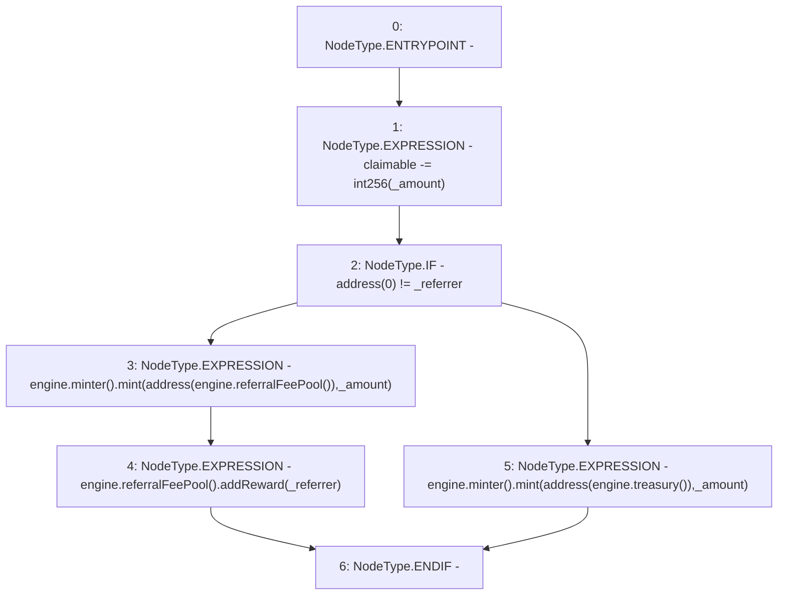

# Context: MochiVault.mintFeeToPool

**Contract:** `MochiVault` (Inherits: IERC3156FlashLender, IMochiVault, Initializable)
**Signature:** `mintFeeToPool(uint256,address)`
**Method Selector ID:** `Internal (No Method ID)`
**Visibility:** `internal`
**Environment-Free:** `Yes`
**Modifiers:** None

### State Variables Interaction
- **Reads:** claimable, engine
- **Writes:** claimable

### Environment & Verification Flags
- **Uses Foundry Cheatcodes:** No
- **Has Echidna Properties:** No

### Internal Calls Tree
- None

### External Calls / Value Transfers
- `IMochiEngine.TMP_204(IMinter) = HIGH_LEVEL_CALL, dest:engine(IMochiEngine), function:minter, arguments:[]  `
- `IMochiEngine.TMP_211(address) = HIGH_LEVEL_CALL, dest:engine(IMochiEngine), function:treasury, arguments:[]  `
- `IMinter.HIGH_LEVEL_CALL, dest:TMP_210(IMinter), function:mint, arguments:['TMP_212', '_amount']  `
- `IMochiEngine.TMP_205(IReferralFeePool) = HIGH_LEVEL_CALL, dest:engine(IMochiEngine), function:referralFeePool, arguments:[]  `
- `IReferralFeePool.HIGH_LEVEL_CALL, dest:TMP_208(IReferralFeePool), function:addReward, arguments:['_referrer']  `
- `IMochiEngine.TMP_210(IMinter) = HIGH_LEVEL_CALL, dest:engine(IMochiEngine), function:minter, arguments:[]  `
- `IMochiEngine.TMP_208(IReferralFeePool) = HIGH_LEVEL_CALL, dest:engine(IMochiEngine), function:referralFeePool, arguments:[]  `
- `IMinter.HIGH_LEVEL_CALL, dest:TMP_204(IMinter), function:mint, arguments:['TMP_206', '_amount']  `

### Control Flow Graph (CFG)


### Source Mapping
Declared in: `certora-ac-datasets/detasets/web3bugs/dataset/web3bugs/42/projects/mochi-core/contracts/vault/MochiVault.sol` on lines **324** to **332**

```solidity
    function mintFeeToPool(uint256 _amount, address _referrer) internal {
        claimable -= int256(_amount);
        if (address(0) != _referrer) {
            engine.minter().mint(address(engine.referralFeePool()), _amount);
            engine.referralFeePool().addReward(_referrer);
        } else {
            engine.minter().mint(address(engine.treasury()), _amount);
        }
    }

```
