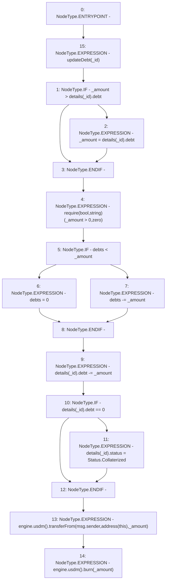

# Context: MochiVault.repay

**Contract:** `MochiVault` (Inherits: IERC3156FlashLender, IMochiVault, Initializable)
**Signature:** `repay(uint256,uint256)`
**Method Selector ID:** `0xd8aed145`
**Visibility:** `public`
**Environment-Free:** `No (reads EVM state context)`
**Modifiers:**
- `updateDebt`
  ```solidity
  modifier updateDebt(uint256 _id) {
          accrueDebt(_id);
          _;
      }
  ```

### State Variables Interaction
- **Reads:** debts, details, engine
- **Writes:** debts, details

### Assertion Checks & Business Requirements
- require/assert: `require(bool,string)(_amount > 0,zero)`

### Environment & Verification Flags
- **Uses Foundry Cheatcodes:** No
- **Has Echidna Properties:** No

### Internal Calls Tree
- None

### External Calls / Value Transfers
- `IMochiEngine.TMP_157(IUSDM) = HIGH_LEVEL_CALL, dest:engine(IMochiEngine), function:usdm, arguments:[]  `
- `IUSDM.TMP_159(bool) = HIGH_LEVEL_CALL, dest:TMP_157(IUSDM), function:transferFrom, arguments:['msg.sender', 'TMP_158', '_amount']  `
- `IMochiEngine.TMP_160(IUSDM) = HIGH_LEVEL_CALL, dest:engine(IMochiEngine), function:usdm, arguments:[]  `
- `IUSDM.HIGH_LEVEL_CALL, dest:TMP_160(IUSDM), function:burn, arguments:['_amount']  `

### Control Flow Graph (CFG)


### Source Mapping
Declared in: `certora-ac-datasets/detasets/web3bugs/dataset/web3bugs/42/projects/mochi-core/contracts/vault/MochiVault.sol` on lines **254** to **275**

```solidity
    function repay(uint256 _id, uint256 _amount)
        public
        override
        updateDebt(_id)
    {
        if (_amount > details[_id].debt) {
            _amount = details[_id].debt;
        }
        require(_amount > 0, "zero");
        if (debts < _amount) {
            // safe gaurd to some underflows
            debts = 0;
        } else {
            debts -= _amount;
        }
        details[_id].debt -= _amount;
        if (details[_id].debt == 0) {
            details[_id].status = Status.Collaterized;
        }
        engine.usdm().transferFrom(msg.sender, address(this), _amount);
        engine.usdm().burn(_amount);
    }

```
