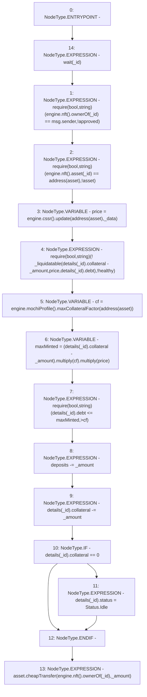

# Context: MochiVault.withdraw

**Contract:** `MochiVault` (Inherits: IERC3156FlashLender, IMochiVault, Initializable)
**Signature:** `withdraw(uint256,uint256,bytes)`
**Method Selector ID:** `0x744fb6ca`
**Visibility:** `public`
**Environment-Free:** `No (reads EVM state context)`
**Modifiers:**
- `wait`
  ```solidity
  modifier wait(uint256 _id) {
          require(
              lastDeposit[_id] + engine.mochiProfile().delay() <= block.timestamp,
              "!wait"
          );
          accrueDebt(_id);
          _;
      }
  ```

### State Variables Interaction
- **Reads:** asset, deposits, details, engine
- **Writes:** deposits, details

### Assertion Checks & Business Requirements
- require/assert: `require(bool,string)(engine.nft().ownerOf(_id) == msg.sender,!approved)`
- require/assert: `require(bool,string)(engine.nft().asset(_id) == address(asset),!asset)`
- require/assert: `require(bool,string)(! _liquidatable(details[_id].collateral - _amount,price,details[_id].debt),!healthy)`
- require/assert: `require(bool,string)(details[_id].debt <= maxMinted,>cf)`

### Environment & Verification Flags
- **Uses Foundry Cheatcodes:** No
- **Has Echidna Properties:** No

### Internal Calls Tree
- None

### External Calls / Value Transfers
- `ICSSRRouter.TMP_86(float) = HIGH_LEVEL_CALL, dest:TMP_84(ICSSRRouter), function:update, arguments:['TMP_85', '_data']  `
- `IMochiNFT.TMP_80(address) = HIGH_LEVEL_CALL, dest:TMP_79(IMochiNFT), function:asset, arguments:['_id']  `
- `CheapERC20.LIBRARY_CALL, dest:CheapERC20, function:CheapERC20.cheapTransfer(IERC20,address,uint256), arguments:['asset', 'TMP_101', '_amount'] `
- `IMochiEngine.TMP_79(IMochiNFT) = HIGH_LEVEL_CALL, dest:engine(IMochiEngine), function:nft, arguments:[]  `
- `IMochiEngine.TMP_84(ICSSRRouter) = HIGH_LEVEL_CALL, dest:engine(IMochiEngine), function:cssr, arguments:[]  `
- `Float.TMP_95(uint256) = LIBRARY_CALL, dest:Float, function:Float.multiply(uint256,float), arguments:['TMP_94', 'cf'] `
- `IMochiEngine.TMP_100(IMochiNFT) = HIGH_LEVEL_CALL, dest:engine(IMochiEngine), function:nft, arguments:[]  `
- `IMochiNFT.TMP_76(address) = HIGH_LEVEL_CALL, dest:TMP_75(IMochiNFT), function:ownerOf, arguments:['_id']  `
- `IMochiProfile.TMP_93(float) = HIGH_LEVEL_CALL, dest:TMP_91(IMochiProfile), function:maxCollateralFactor, arguments:['TMP_92']  `
- `Float.TMP_96(uint256) = LIBRARY_CALL, dest:Float, function:Float.multiply(uint256,float), arguments:['TMP_95', 'price'] `
- `IMochiEngine.TMP_91(IMochiProfile) = HIGH_LEVEL_CALL, dest:engine(IMochiEngine), function:mochiProfile, arguments:[]  `
- `IMochiEngine.TMP_75(IMochiNFT) = HIGH_LEVEL_CALL, dest:engine(IMochiEngine), function:nft, arguments:[]  `
- `IMochiNFT.TMP_101(address) = HIGH_LEVEL_CALL, dest:TMP_100(IMochiNFT), function:ownerOf, arguments:['_id']  `

### Control Flow Graph (CFG)


### Source Mapping
Declared in: `certora-ac-datasets/detasets/web3bugs/dataset/web3bugs/42/projects/mochi-core/contracts/vault/MochiVault.sol` on lines **181** to **211**

```solidity
    function withdraw(
        uint256 _id,
        uint256 _amount,
        bytes memory _data
    ) public override wait(_id) {
        require(engine.nft().ownerOf(_id) == msg.sender, "!approved");
        require(engine.nft().asset(_id) == address(asset), "!asset");
        // update prior to interaction
        float memory price = engine.cssr().update(address(asset), _data);
        require(
            !_liquidatable(
                details[_id].collateral - _amount,
                price,
                details[_id].debt
            ),
            "!healthy"
        );
        float memory cf = engine.mochiProfile().maxCollateralFactor(
            address(asset)
        );
        uint256 maxMinted = (details[_id].collateral - _amount)
            .multiply(cf)
            .multiply(price);
        require(details[_id].debt <= maxMinted, ">cf");
        deposits -= _amount;
        details[_id].collateral -= _amount;
        if (details[_id].collateral == 0) {
            details[_id].status = Status.Idle;
        }
        asset.cheapTransfer(engine.nft().ownerOf(_id), _amount);
    }

```
