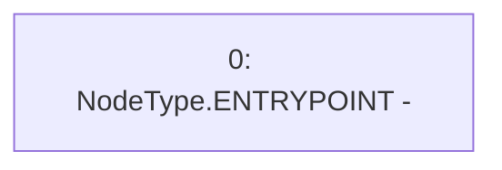

# Context: Mochi._beforeTokenTransfer

**Contract:** `Mochi` (Inherits: ERC20, IERC20Metadata, IERC20, Context)
**Signature:** `_beforeTokenTransfer(address,address,uint256)`
**Method Selector ID:** `Internal (No Method ID)`
**Visibility:** `internal`
**Environment-Free:** `Yes`
**Modifiers:** None

### State Variables Interaction
- **Reads:** None
- **Writes:** None

### Environment & Verification Flags
- **Uses Foundry Cheatcodes:** No
- **Has Echidna Properties:** No

### Internal Calls Tree
- None

### External Calls / Value Transfers
- None

### Control Flow Graph (CFG)


### Source Mapping
Declared in: `certora-ac-datasets/detasets/web3bugs/dataset/web3bugs/42/projects/mochi-core/node_modules/@openzeppelin/contracts/token/ERC20/ERC20.sol` on lines **348** to **348**

```solidity
    function _beforeTokenTransfer(address from, address to, uint256 amount) internal virtual {}

```
