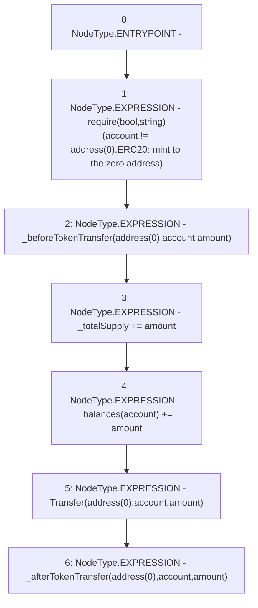

# Context: Mochi._mint

**Contract:** `Mochi` (Inherits: ERC20, IERC20Metadata, IERC20, Context)
**Signature:** `_mint(address,uint256)`
**Method Selector ID:** `Internal (No Method ID)`
**Visibility:** `internal`
**Environment-Free:** `Yes`
**Modifiers:** None

### State Variables Interaction
- **Reads:** _balances, _totalSupply
- **Writes:** _balances, _totalSupply

### Assertion Checks & Business Requirements
- require/assert: `require(bool,string)(account != address(0),ERC20: mint to the zero address)`

### Environment & Verification Flags
- **Uses Foundry Cheatcodes:** No
- **Has Echidna Properties:** No

### Internal Calls Tree
- None

### External Calls / Value Transfers
- None

### Control Flow Graph (CFG)


### Source Mapping
Declared in: `certora-ac-datasets/detasets/web3bugs/dataset/web3bugs/42/projects/mochi-core/node_modules/@openzeppelin/contracts/token/ERC20/ERC20.sol` on lines **251** to **264**

```solidity
    function _mint(address account, uint256 amount) internal virtual {
        require(account != address(0), "ERC20: mint to the zero address");

        _beforeTokenTransfer(address(0), account, amount);

        _totalSupply += amount;
        unchecked {
            // Overflow not possible: balance + amount is at most totalSupply + amount, which is checked above.
            _balances[account] += amount;
        }
        emit Transfer(address(0), account, amount);

        _afterTokenTransfer(address(0), account, amount);
    }

```
