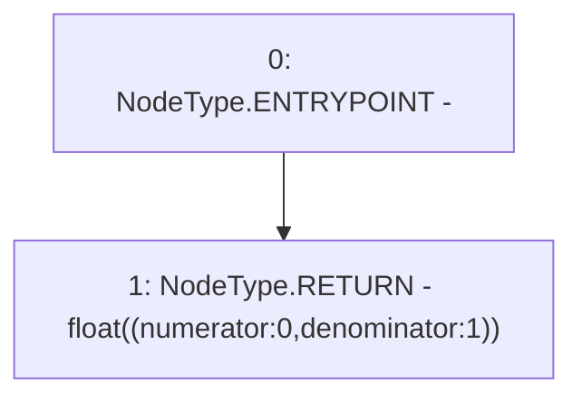

# Context: NoDiscountProfile.discount

**Contract:** `NoDiscountProfile` (Inherits: IDiscountProfile)
**Signature:** `discount(address) returns (float)`
**Method Selector ID:** `0xce068980`
**Visibility:** `external`
**Environment-Free:** `Yes`
**Modifiers:** None

### State Variables Interaction
- **Reads:** None
- **Writes:** None

### Environment & Verification Flags
- **Uses Foundry Cheatcodes:** No
- **Has Echidna Properties:** No

### Internal Calls Tree
- None

### External Calls / Value Transfers
- None

### Control Flow Graph (CFG)


### Source Mapping
Declared in: `certora-ac-datasets/detasets/web3bugs/dataset/web3bugs/42/projects/mochi-core/contracts/profile/NoDiscountProfile.sol` on lines **8** to **10**

```solidity
    function discount(address) external pure override returns (float memory) {
        return float({numerator: 0, denominator: 1});
    }

```
