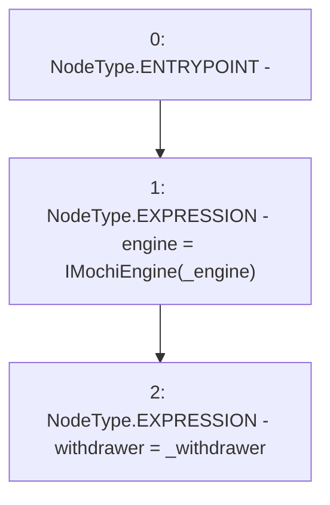

# Context: NoMochiFeePool.constructor

**Contract:** `NoMochiFeePool` (Inherits: IFeePool)
**Signature:** `constructor(address,address)`
**Method Selector ID:** `0x4525f804`
**Visibility:** `public`
**Environment-Free:** `Yes`
**Modifiers:** None

### State Variables Interaction
- **Reads:** None
- **Writes:** engine, withdrawer

### Environment & Verification Flags
- **Uses Foundry Cheatcodes:** No
- **Has Echidna Properties:** No

### Internal Calls Tree
- None

### External Calls / Value Transfers
- None

### Control Flow Graph (CFG)


### Source Mapping
Declared in: `certora-ac-datasets/detasets/web3bugs/dataset/web3bugs/42/projects/mochi-core/contracts/feePool/NoMochiFeePool.sol` on lines **12** to **15**

```solidity
    constructor(address _withdrawer, address _engine) {
        engine = IMochiEngine(_engine);
        withdrawer = _withdrawer;
    }

```
