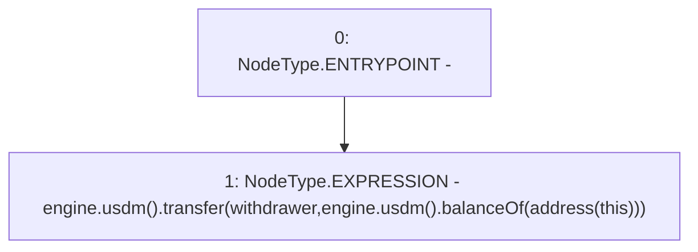

# Context: NoMochiFeePool.withdraw

**Contract:** `NoMochiFeePool` (Inherits: IFeePool)
**Signature:** `withdraw()`
**Method Selector ID:** `0x3ccfd60b`
**Visibility:** `external`
**Environment-Free:** `Yes`
**Modifiers:** None

### State Variables Interaction
- **Reads:** engine, withdrawer
- **Writes:** None

### Environment & Verification Flags
- **Uses Foundry Cheatcodes:** No
- **Has Echidna Properties:** No

### Internal Calls Tree
- None

### External Calls / Value Transfers
- `IUSDM.TMP_5(bool) = HIGH_LEVEL_CALL, dest:TMP_1(IUSDM), function:transfer, arguments:['withdrawer', 'TMP_4']  `
- `IMochiEngine.TMP_1(IUSDM) = HIGH_LEVEL_CALL, dest:engine(IMochiEngine), function:usdm, arguments:[]  `
- `IUSDM.TMP_4(uint256) = HIGH_LEVEL_CALL, dest:TMP_2(IUSDM), function:balanceOf, arguments:['TMP_3']  `
- `IMochiEngine.TMP_2(IUSDM) = HIGH_LEVEL_CALL, dest:engine(IMochiEngine), function:usdm, arguments:[]  `

### Control Flow Graph (CFG)


### Source Mapping
Declared in: `certora-ac-datasets/detasets/web3bugs/dataset/web3bugs/42/projects/mochi-core/contracts/feePool/NoMochiFeePool.sol` on lines **21** to **26**

```solidity
    function withdraw() external {
        engine.usdm().transfer(
            withdrawer,
            engine.usdm().balanceOf(address(this))
        );
    }

```
