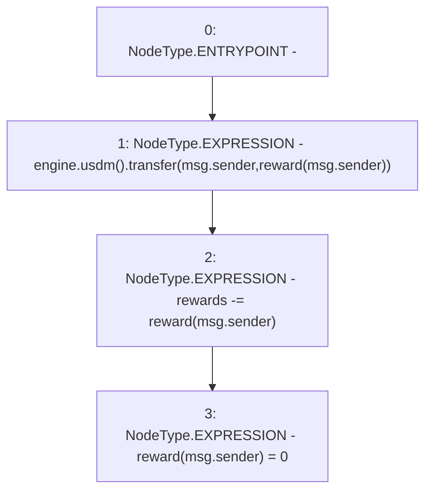

# Context: NoMochiReferralFeePool.claimReward

**Contract:** `NoMochiReferralFeePool` (Inherits: IReferralFeePool)
**Signature:** `claimReward()`
**Method Selector ID:** `0xb88a802f`
**Visibility:** `external`
**Environment-Free:** `No (reads EVM state context)`
**Modifiers:** None

### State Variables Interaction
- **Reads:** engine, reward, rewards
- **Writes:** reward, rewards

### Environment & Verification Flags
- **Uses Foundry Cheatcodes:** No
- **Has Echidna Properties:** No

### Internal Calls Tree
- None

### External Calls / Value Transfers
- `IUSDM.TMP_6(bool) = HIGH_LEVEL_CALL, dest:TMP_5(IUSDM), function:transfer, arguments:['msg.sender', 'REF_5']  `
- `IMochiEngine.TMP_5(IUSDM) = HIGH_LEVEL_CALL, dest:engine(IMochiEngine), function:usdm, arguments:[]  `

### Control Flow Graph (CFG)


### Source Mapping
Declared in: `certora-ac-datasets/detasets/web3bugs/dataset/web3bugs/42/projects/mochi-core/contracts/feePool/NoMochiReferralFeePool.sol` on lines **25** to **29**

```solidity
    function claimReward() external {
        engine.usdm().transfer(msg.sender, reward[msg.sender]);
        rewards -= reward[msg.sender];
        reward[msg.sender] = 0;
    }

```
