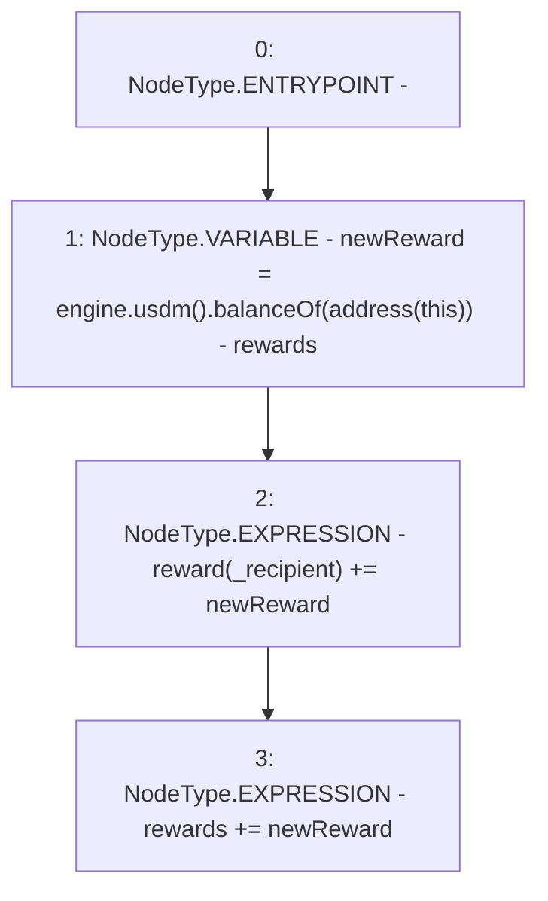

# Context: ReferralFeePoolV0.addReward

**Contract:** `ReferralFeePoolV0` (Inherits: IReferralFeePool)
**Signature:** `addReward(address)`
**Method Selector ID:** `0x9c9b2e21`
**Visibility:** `external`
**Environment-Free:** `Yes`
**Modifiers:** None

### State Variables Interaction
- **Reads:** engine, reward, rewards
- **Writes:** reward, rewards

### Environment & Verification Flags
- **Uses Foundry Cheatcodes:** No
- **Has Echidna Properties:** No

### Internal Calls Tree
- None

### External Calls / Value Transfers
- `IUSDM.TMP_4(uint256) = HIGH_LEVEL_CALL, dest:TMP_2(IUSDM), function:balanceOf, arguments:['TMP_3']  `
- `IMochiEngine.TMP_2(IUSDM) = HIGH_LEVEL_CALL, dest:engine(IMochiEngine), function:usdm, arguments:[]  `

### Control Flow Graph (CFG)


### Source Mapping
Declared in: `certora-ac-datasets/detasets/web3bugs/dataset/web3bugs/42/projects/mochi-core/contracts/feePool/ReferralFeePoolV0.sol` on lines **22** to **26**

```solidity
    function addReward(address _recipient) external override {
        uint256 newReward = engine.usdm().balanceOf(address(this)) - rewards;
        reward[_recipient] += newReward;
        rewards += newReward;
    }

```
