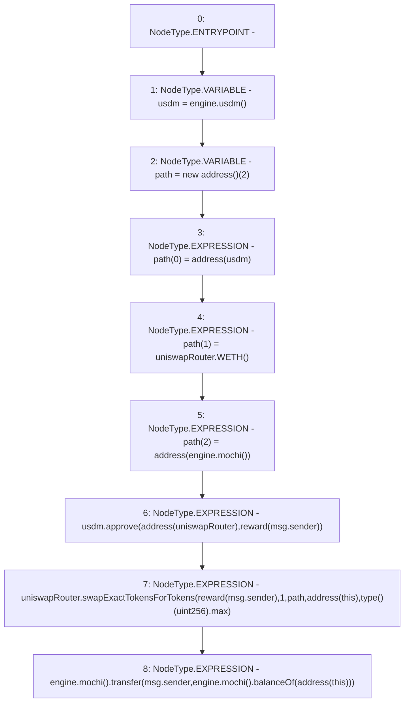

# Context: ReferralFeePoolV0.claimRewardAsMochi

**Contract:** `ReferralFeePoolV0` (Inherits: IReferralFeePool)
**Signature:** `claimRewardAsMochi()`
**Method Selector ID:** `0x1af829fe`
**Visibility:** `external`
**Environment-Free:** `No (reads EVM state context)`
**Modifiers:** None

### State Variables Interaction
- **Reads:** engine, reward, uniswapRouter
- **Writes:** None

### Environment & Verification Flags
- **Uses Foundry Cheatcodes:** No
- **Has Echidna Properties:** No

### Internal Calls Tree
- None

### External Calls / Value Transfers
- `IMochi.TMP_22(uint256) = HIGH_LEVEL_CALL, dest:TMP_20(IMochi), function:balanceOf, arguments:['TMP_21']  `
- `IMochiEngine.TMP_6(IUSDM) = HIGH_LEVEL_CALL, dest:engine(IMochiEngine), function:usdm, arguments:[]  `
- `IMochiEngine.TMP_19(IMochi) = HIGH_LEVEL_CALL, dest:engine(IMochiEngine), function:mochi, arguments:[]  `
- `IMochi.TMP_23(bool) = HIGH_LEVEL_CALL, dest:TMP_19(IMochi), function:transfer, arguments:['msg.sender', 'TMP_22']  `
- `IUSDM.TMP_14(bool) = HIGH_LEVEL_CALL, dest:usdm(IUSDM), function:approve, arguments:['TMP_13', 'REF_10']  `
- `IMochiEngine.TMP_11(IMochi) = HIGH_LEVEL_CALL, dest:engine(IMochiEngine), function:mochi, arguments:[]  `
- `IUniswapV2Router02.TMP_10(address) = HIGH_LEVEL_CALL, dest:uniswapRouter(IUniswapV2Router02), function:WETH, arguments:[]  `
- `IMochiEngine.TMP_20(IMochi) = HIGH_LEVEL_CALL, dest:engine(IMochiEngine), function:mochi, arguments:[]  `
- `IUniswapV2Router02.TMP_18(uint256[]) = HIGH_LEVEL_CALL, dest:uniswapRouter(IUniswapV2Router02), function:swapExactTokensForTokens, arguments:['REF_12', '1', 'path', 'TMP_15', 'TMP_17']  `

### Control Flow Graph (CFG)


### Source Mapping
Declared in: `certora-ac-datasets/detasets/web3bugs/dataset/web3bugs/42/projects/mochi-core/contracts/feePool/ReferralFeePoolV0.sol` on lines **28** to **47**

```solidity
    function claimRewardAsMochi() external {
        IUSDM usdm = engine.usdm();
        address[] memory path = new address[](2);
        path[0] = address(usdm);
        path[1] = uniswapRouter.WETH();
        path[2] = address(engine.mochi());
        usdm.approve(address(uniswapRouter), reward[msg.sender]);
        // we are going to ingore the slippages here
        uniswapRouter.swapExactTokensForTokens(
            reward[msg.sender],
            1,
            path,
            address(this),
            type(uint256).max
        );
        engine.mochi().transfer(
            msg.sender,
            engine.mochi().balanceOf(address(this))
        );
    }

```
