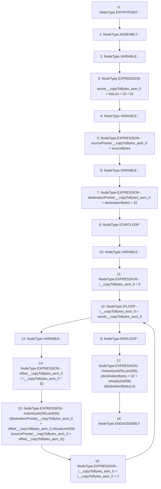

# Context: Rlp._copyToBytes

**Contract:** `Rlp` (Inherits: None)
**Signature:** `_copyToBytes(uint256,bytes,uint256)`
**Method Selector ID:** `Internal (No Method ID)`
**Visibility:** `internal`
**Environment-Free:** `Yes`
**Modifiers:** None

### State Variables Interaction
- **Reads:** None
- **Writes:** None

### Environment & Verification Flags
- **Uses Foundry Cheatcodes:** No
- **Has Echidna Properties:** No

### Internal Calls Tree
- None

### External Calls / Value Transfers
- None

### Control Flow Graph (CFG)


### Source Mapping
Declared in: `certora-ac-datasets/detasets/web3bugs/dataset/web3bugs/42/projects/mochi-library/contracts/Rlp.sol` on lines **367** to **381**

```solidity
    function _copyToBytes(uint sourceBytes, bytes memory destinationBytes, uint btsLen) internal pure {
        // Exploiting the fact that 'tgt' was the last thing to be allocated,
        // we can write entire words, and just overwrite any excess.
        assembly {
            let words := div(add(btsLen, 31), 32)
            let sourcePointer := sourceBytes
            let destinationPointer := add(destinationBytes, 32)
            for { let i := 0 } lt(i, words) { i := add(i, 1) }
            {
                let offset := mul(i, 32)
                mstore(add(destinationPointer, offset), mload(add(sourcePointer, offset)))
            }
            mstore(add(destinationBytes, add(32, mload(destinationBytes))), 0)
        }
    }

```
