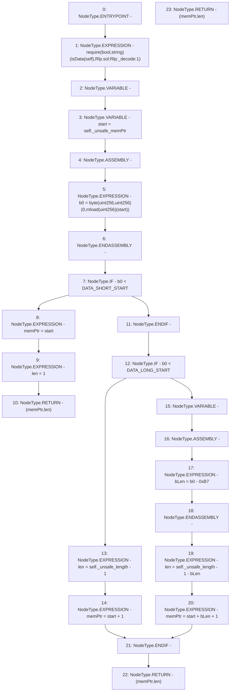

# Context: Rlp._decode

**Contract:** `Rlp` (Inherits: None)
**Signature:** `_decode(Rlp.Item) returns (uint256, uint256)`
**Method Selector ID:** `Internal (No Method ID)`
**Visibility:** `private`
**Environment-Free:** `Yes`
**Modifiers:** None

### State Variables Interaction
- **Reads:** DATA_LONG_START, DATA_SHORT_START
- **Writes:** None

### Assertion Checks & Business Requirements
- require/assert: `require(bool,string)(isData(self),Rlp.sol:Rlp:_decode:1)`

### Environment & Verification Flags
- **Uses Foundry Cheatcodes:** No
- **Has Echidna Properties:** No

### Internal Calls Tree
- None

### External Calls / Value Transfers
- None

### Control Flow Graph (CFG)


### Source Mapping
Declared in: `certora-ac-datasets/detasets/web3bugs/dataset/web3bugs/42/projects/mochi-library/contracts/Rlp.sol` on lines **340** to **364**

```solidity
    function _decode(Item memory self) private pure returns (uint memPtr, uint len) {
        require(isData(self), "Rlp.sol:Rlp:_decode:1");
        uint b0;
        uint start = self._unsafe_memPtr;
        assembly {
            b0 := byte(0, mload(start))
        }
        if (b0 < DATA_SHORT_START) {
            memPtr = start;
            len = 1;
            return (memPtr, len);
        }
        if (b0 < DATA_LONG_START) {
            len = self._unsafe_length - 1;
            memPtr = start + 1;
        } else {
            uint bLen;
            assembly {
                bLen := sub(b0, 0xB7) // DATA_LONG_OFFSET
            }
            len = self._unsafe_length - 1 - bLen;
            memPtr = start + bLen + 1;
        }
        return (memPtr, len);
    }

```
