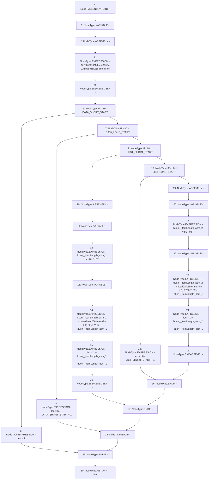

# Context: Rlp._itemLength

**Contract:** `Rlp` (Inherits: None)
**Signature:** `_itemLength(uint256) returns (uint256)`
**Method Selector ID:** `Internal (No Method ID)`
**Visibility:** `private`
**Environment-Free:** `Yes`
**Modifiers:** None

### State Variables Interaction
- **Reads:** DATA_LONG_START, DATA_SHORT_START, LIST_LONG_START, LIST_SHORT_START
- **Writes:** None

### Environment & Verification Flags
- **Uses Foundry Cheatcodes:** No
- **Has Echidna Properties:** No

### Internal Calls Tree
- None

### External Calls / Value Transfers
- None

### Control Flow Graph (CFG)


### Source Mapping
Declared in: `certora-ac-datasets/detasets/web3bugs/dataset/web3bugs/42/projects/mochi-library/contracts/Rlp.sol` on lines **312** to **337**

```solidity
    function _itemLength(uint memPtr) private pure returns (uint len) {
        uint b0;
        assembly {
            b0 := byte(0, mload(memPtr))
        }
        if (b0 < DATA_SHORT_START)
            len = 1;
        else if (b0 < DATA_LONG_START)
            len = b0 - DATA_SHORT_START + 1;
        else if (b0 < LIST_SHORT_START) {
            assembly {
                let bLen := sub(b0, 0xB7) // bytes length (DATA_LONG_OFFSET)
                let dLen := div(mload(add(memPtr, 1)), exp(256, sub(32, bLen))) // data length
                len := add(1, add(bLen, dLen)) // total length
            }
        }
        else if (b0 < LIST_LONG_START)
            len = b0 - LIST_SHORT_START + 1;
        else {
            assembly {
                let bLen := sub(b0, 0xF7) // bytes length (LIST_LONG_OFFSET)
                let dLen := div(mload(add(memPtr, 1)), exp(256, sub(32, bLen))) // data length
                len := add(1, add(bLen, dLen)) // total length
            }
        }
    }

```
