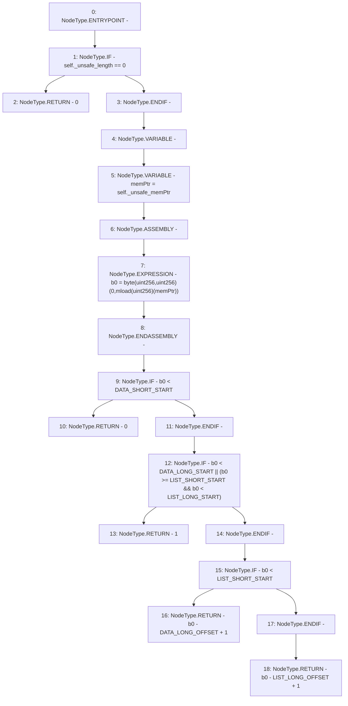

# Context: Rlp._payloadOffset

**Contract:** `Rlp` (Inherits: None)
**Signature:** `_payloadOffset(Rlp.Item) returns (uint256)`
**Method Selector ID:** `Internal (No Method ID)`
**Visibility:** `private`
**Environment-Free:** `Yes`
**Modifiers:** None

### State Variables Interaction
- **Reads:** DATA_LONG_OFFSET, DATA_LONG_START, DATA_SHORT_START, LIST_LONG_OFFSET, LIST_LONG_START, LIST_SHORT_START
- **Writes:** None

### Environment & Verification Flags
- **Uses Foundry Cheatcodes:** No
- **Has Echidna Properties:** No

### Internal Calls Tree
- None

### External Calls / Value Transfers
- None

### Control Flow Graph (CFG)


### Source Mapping
Declared in: `certora-ac-datasets/detasets/web3bugs/dataset/web3bugs/42/projects/mochi-library/contracts/Rlp.sol` on lines **294** to **309**

```solidity
    function _payloadOffset(Item memory self) private pure returns (uint) {
        if(self._unsafe_length == 0)
            return 0;
        uint b0;
        uint memPtr = self._unsafe_memPtr;
        assembly {
            b0 := byte(0, mload(memPtr))
        }
        if(b0 < DATA_SHORT_START)
            return 0;
        if(b0 < DATA_LONG_START || (b0 >= LIST_SHORT_START && b0 < LIST_LONG_START))
            return 1;
        if(b0 < LIST_SHORT_START)
            return b0 - DATA_LONG_OFFSET + 1;
        return b0 - LIST_LONG_OFFSET + 1;
    }

```
