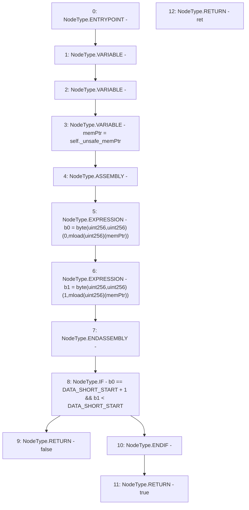

# Context: Rlp._validate

**Contract:** `Rlp` (Inherits: None)
**Signature:** `_validate(Rlp.Item) returns (bool)`
**Method Selector ID:** `Internal (No Method ID)`
**Visibility:** `private`
**Environment-Free:** `Yes`
**Modifiers:** None

### State Variables Interaction
- **Reads:** DATA_SHORT_START
- **Writes:** None

### Environment & Verification Flags
- **Uses Foundry Cheatcodes:** No
- **Has Echidna Properties:** No

### Internal Calls Tree
- None

### External Calls / Value Transfers
- None

### Control Flow Graph (CFG)


### Source Mapping
Declared in: `certora-ac-datasets/detasets/web3bugs/dataset/web3bugs/42/projects/mochi-library/contracts/Rlp.sol` on lines **384** to **396**

```solidity
    function _validate(Item memory self) private pure returns (bool ret) {
        // Check that RLP is well-formed.
        uint b0;
        uint b1;
        uint memPtr = self._unsafe_memPtr;
        assembly {
            b0 := byte(0, mload(memPtr))
            b1 := byte(1, mload(memPtr))
        }
        if(b0 == DATA_SHORT_START + 1 && b1 < DATA_SHORT_START)
            return false;
        return true;
    }

```
