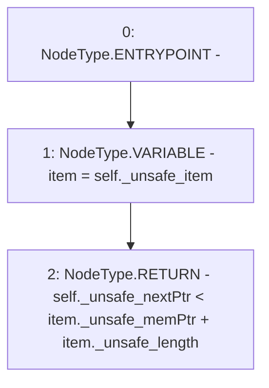

# Context: Rlp.hasNext

**Contract:** `Rlp` (Inherits: None)
**Signature:** `hasNext(Rlp.Iterator) returns (bool)`
**Method Selector ID:** `Internal (No Method ID)`
**Visibility:** `internal`
**Environment-Free:** `Yes`
**Modifiers:** None

### State Variables Interaction
- **Reads:** None
- **Writes:** None

### Environment & Verification Flags
- **Uses Foundry Cheatcodes:** No
- **Has Echidna Properties:** No

### Internal Calls Tree
- None

### External Calls / Value Transfers
- None

### Control Flow Graph (CFG)


### Source Mapping
Declared in: `certora-ac-datasets/detasets/web3bugs/dataset/web3bugs/42/projects/mochi-library/contracts/Rlp.sol` on lines **41** to **44**

```solidity
    function hasNext(Iterator memory self) internal pure returns (bool) {
        Rlp.Item memory item = self._unsafe_item;
        return self._unsafe_nextPtr < item._unsafe_memPtr + item._unsafe_length;
    }

```
