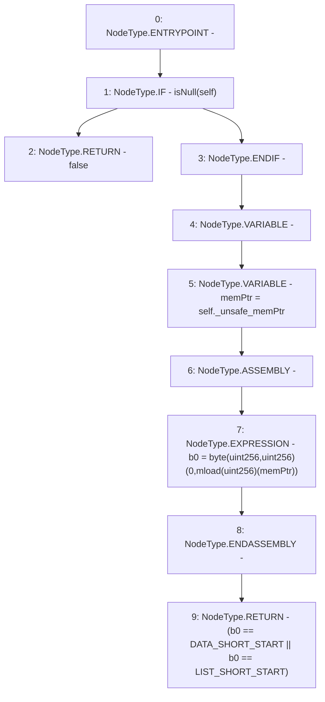

# Context: Rlp.isEmpty

**Contract:** `Rlp` (Inherits: None)
**Signature:** `isEmpty(Rlp.Item) returns (bool)`
**Method Selector ID:** `Internal (No Method ID)`
**Visibility:** `internal`
**Environment-Free:** `Yes`
**Modifiers:** None

### State Variables Interaction
- **Reads:** DATA_SHORT_START, LIST_SHORT_START
- **Writes:** None

### Environment & Verification Flags
- **Uses Foundry Cheatcodes:** No
- **Has Echidna Properties:** No

### Internal Calls Tree
- None

### External Calls / Value Transfers
- None

### Control Flow Graph (CFG)


### Source Mapping
Declared in: `certora-ac-datasets/detasets/web3bugs/dataset/web3bugs/42/projects/mochi-library/contracts/Rlp.sol` on lines **116** to **125**

```solidity
    function isEmpty(Item memory self) internal pure returns (bool) {
        if(isNull(self))
            return false;
        uint b0;
        uint memPtr = self._unsafe_memPtr;
        assembly {
            b0 := byte(0, mload(memPtr))
        }
        return (b0 == DATA_SHORT_START || b0 == LIST_SHORT_START);
    }

```
