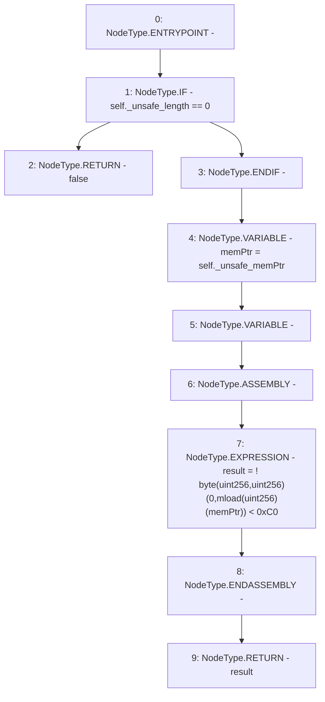

# Context: Rlp.isList

**Contract:** `Rlp` (Inherits: None)
**Signature:** `isList(Rlp.Item) returns (bool)`
**Method Selector ID:** `Internal (No Method ID)`
**Visibility:** `internal`
**Environment-Free:** `Yes`
**Modifiers:** None

### State Variables Interaction
- **Reads:** None
- **Writes:** None

### Environment & Verification Flags
- **Uses Foundry Cheatcodes:** No
- **Has Echidna Properties:** No

### Internal Calls Tree
- None

### External Calls / Value Transfers
- None

### Control Flow Graph (CFG)


### Source Mapping
Declared in: `certora-ac-datasets/detasets/web3bugs/dataset/web3bugs/42/projects/mochi-library/contracts/Rlp.sol` on lines **88** to **97**

```solidity
    function isList(Item memory self) internal pure returns (bool) {
        if (self._unsafe_length == 0)
            return false;
        uint memPtr = self._unsafe_memPtr;
        bool result;
        assembly {
            result := iszero(lt(byte(0, mload(memPtr)), 0xC0))
        }
        return result;
    }

```
