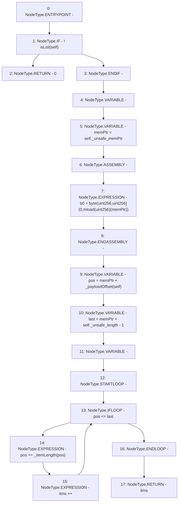

# Context: Rlp.items

**Contract:** `Rlp` (Inherits: None)
**Signature:** `items(Rlp.Item) returns (uint256)`
**Method Selector ID:** `Internal (No Method ID)`
**Visibility:** `internal`
**Environment-Free:** `Yes`
**Modifiers:** None

### State Variables Interaction
- **Reads:** None
- **Writes:** None

### Environment & Verification Flags
- **Uses Foundry Cheatcodes:** No
- **Has Echidna Properties:** No

### Internal Calls Tree
- None

### External Calls / Value Transfers
- None

### Control Flow Graph (CFG)


### Source Mapping
Declared in: `certora-ac-datasets/detasets/web3bugs/dataset/web3bugs/42/projects/mochi-library/contracts/Rlp.sol` on lines **130** to **146**

```solidity
    function items(Item memory self) internal pure returns (uint) {
        if (!isList(self))
            return 0;
        uint b0;
        uint memPtr = self._unsafe_memPtr;
        assembly {
            b0 := byte(0, mload(memPtr))
        }
        uint pos = memPtr + _payloadOffset(self);
        uint last = memPtr + self._unsafe_length - 1;
        uint itms;
        while(pos <= last) {
            pos += _itemLength(pos);
            itms++;
        }
        return itms;
    }

```
