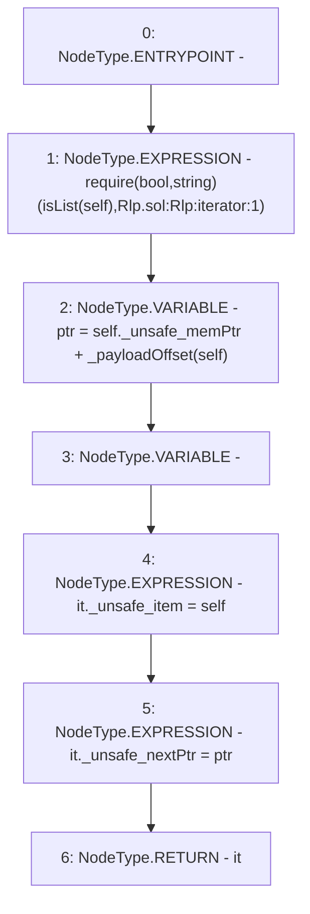

# Context: Rlp.iterator

**Contract:** `Rlp` (Inherits: None)
**Signature:** `iterator(Rlp.Item) returns (Rlp.Iterator)`
**Method Selector ID:** `Internal (No Method ID)`
**Visibility:** `internal`
**Environment-Free:** `Yes`
**Modifiers:** None

### State Variables Interaction
- **Reads:** None
- **Writes:** None

### Assertion Checks & Business Requirements
- require/assert: `require(bool,string)(isList(self),Rlp.sol:Rlp:iterator:1)`

### Environment & Verification Flags
- **Uses Foundry Cheatcodes:** No
- **Has Echidna Properties:** No

### Internal Calls Tree
- None

### External Calls / Value Transfers
- None

### Control Flow Graph (CFG)


### Source Mapping
Declared in: `certora-ac-datasets/detasets/web3bugs/dataset/web3bugs/42/projects/mochi-library/contracts/Rlp.sol` on lines **151** to **158**

```solidity
    function iterator(Item memory self) internal pure returns (Iterator memory) {
        require(isList(self), "Rlp.sol:Rlp:iterator:1");
        uint ptr = self._unsafe_memPtr + _payloadOffset(self);
        Iterator memory it;
        it._unsafe_item = self;
        it._unsafe_nextPtr = ptr;
        return it;
    }

```
