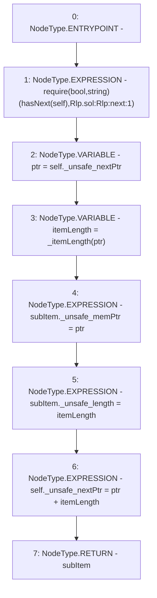

# Context: Rlp.next

**Contract:** `Rlp` (Inherits: None)
**Signature:** `next(Rlp.Iterator) returns (Rlp.Item)`
**Method Selector ID:** `Internal (No Method ID)`
**Visibility:** `internal`
**Environment-Free:** `Yes`
**Modifiers:** None

### State Variables Interaction
- **Reads:** None
- **Writes:** None

### Assertion Checks & Business Requirements
- require/assert: `require(bool,string)(hasNext(self),Rlp.sol:Rlp:next:1)`

### Environment & Verification Flags
- **Uses Foundry Cheatcodes:** No
- **Has Echidna Properties:** No

### Internal Calls Tree
- None

### External Calls / Value Transfers
- None

### Control Flow Graph (CFG)


### Source Mapping
Declared in: `certora-ac-datasets/detasets/web3bugs/dataset/web3bugs/42/projects/mochi-library/contracts/Rlp.sol` on lines **27** to **34**

```solidity
    function next(Iterator memory self) internal pure returns (Item memory subItem) {
        require(hasNext(self), "Rlp.sol:Rlp:next:1");
        uint256 ptr = self._unsafe_nextPtr;
        uint256 itemLength = _itemLength(ptr);
        subItem._unsafe_memPtr = ptr;
        subItem._unsafe_length = itemLength;
        self._unsafe_nextPtr = ptr + itemLength;
    }

```
