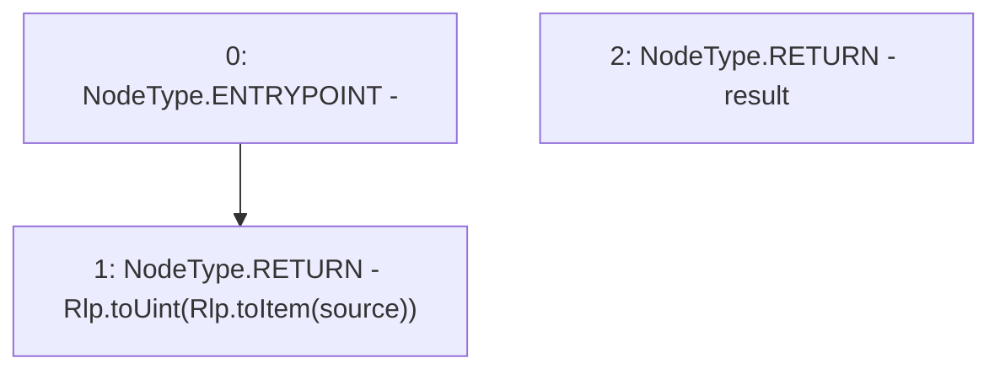

# Context: Rlp.rlpBytesToUint256

**Contract:** `Rlp` (Inherits: None)
**Signature:** `rlpBytesToUint256(bytes) returns (uint256)`
**Method Selector ID:** `Internal (No Method ID)`
**Visibility:** `internal`
**Environment-Free:** `Yes`
**Modifiers:** None

### State Variables Interaction
- **Reads:** None
- **Writes:** None

### Environment & Verification Flags
- **Uses Foundry Cheatcodes:** No
- **Has Echidna Properties:** No

### Internal Calls Tree
- None

### External Calls / Value Transfers
- None

### Control Flow Graph (CFG)


### Source Mapping
Declared in: `certora-ac-datasets/detasets/web3bugs/dataset/web3bugs/42/projects/mochi-library/contracts/Rlp.sol` on lines **398** to **400**

```solidity
    function rlpBytesToUint256(bytes memory source) internal pure returns (uint256 result) {
        return Rlp.toUint(Rlp.toItem(source));
    }

```
