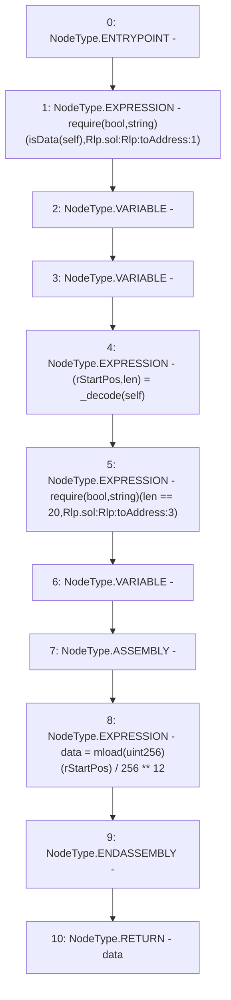

# Context: Rlp.toAddress

**Contract:** `Rlp` (Inherits: None)
**Signature:** `toAddress(Rlp.Item) returns (address)`
**Method Selector ID:** `Internal (No Method ID)`
**Visibility:** `internal`
**Environment-Free:** `Yes`
**Modifiers:** None

### State Variables Interaction
- **Reads:** None
- **Writes:** None

### Assertion Checks & Business Requirements
- require/assert: `require(bool,string)(isData(self),Rlp.sol:Rlp:toAddress:1)`
- require/assert: `require(bool,string)(len == 20,Rlp.sol:Rlp:toAddress:3)`

### Environment & Verification Flags
- **Uses Foundry Cheatcodes:** No
- **Has Echidna Properties:** No

### Internal Calls Tree
- None

### External Calls / Value Transfers
- None

### Control Flow Graph (CFG)


### Source Mapping
Declared in: `certora-ac-datasets/detasets/web3bugs/dataset/web3bugs/42/projects/mochi-library/contracts/Rlp.sol` on lines **282** to **291**

```solidity
    function toAddress(Item memory self) internal pure returns (address) {
        require(isData(self), "Rlp.sol:Rlp:toAddress:1");
        (uint256 rStartPos, uint256 len) = _decode(self);
        require(len == 20, "Rlp.sol:Rlp:toAddress:3");
        address data;
        assembly {
            data := div(mload(rStartPos), exp(256, 12))
        }
        return data;
    }

```
