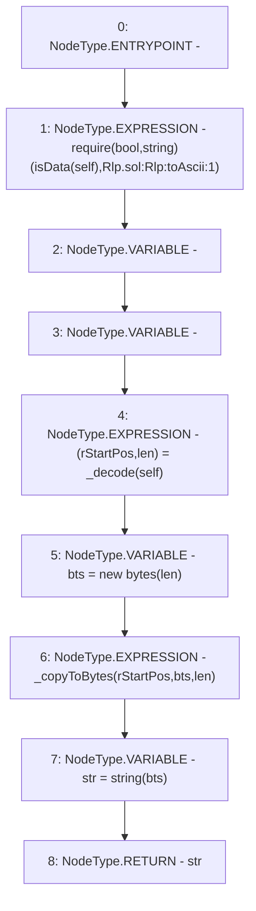

# Context: Rlp.toAscii

**Contract:** `Rlp` (Inherits: None)
**Signature:** `toAscii(Rlp.Item) returns (string)`
**Method Selector ID:** `Internal (No Method ID)`
**Visibility:** `internal`
**Environment-Free:** `Yes`
**Modifiers:** None

### State Variables Interaction
- **Reads:** None
- **Writes:** None

### Assertion Checks & Business Requirements
- require/assert: `require(bool,string)(isData(self),Rlp.sol:Rlp:toAscii:1)`

### Environment & Verification Flags
- **Uses Foundry Cheatcodes:** No
- **Has Echidna Properties:** No

### Internal Calls Tree
- None

### External Calls / Value Transfers
- None

### Control Flow Graph (CFG)


### Source Mapping
Declared in: `certora-ac-datasets/detasets/web3bugs/dataset/web3bugs/42/projects/mochi-library/contracts/Rlp.sol` on lines **206** to **213**

```solidity
    function toAscii(Item memory self) internal pure returns (string memory) {
        require(isData(self), "Rlp.sol:Rlp:toAscii:1");
        (uint256 rStartPos, uint256 len) = _decode(self);
        bytes memory bts = new bytes(len);
        _copyToBytes(rStartPos, bts, len);
        string memory str = string(bts);
        return str;
    }

```
