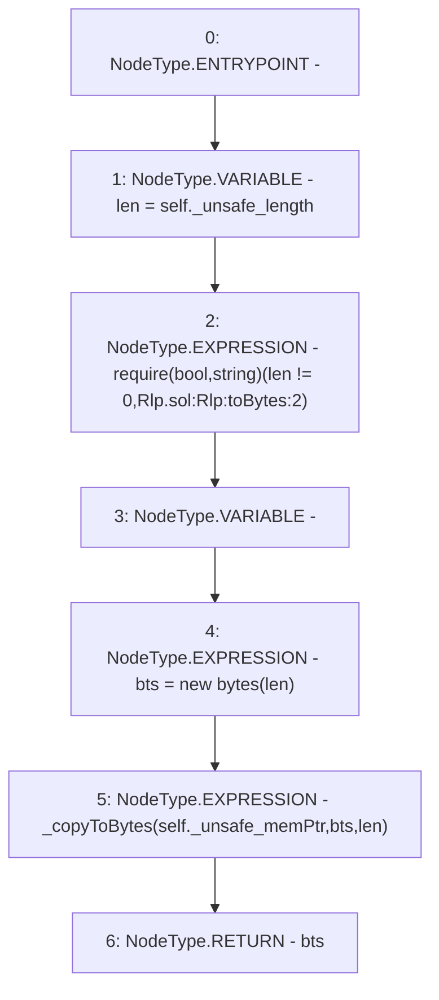

# Context: Rlp.toBytes

**Contract:** `Rlp` (Inherits: None)
**Signature:** `toBytes(Rlp.Item) returns (bytes)`
**Method Selector ID:** `Internal (No Method ID)`
**Visibility:** `internal`
**Environment-Free:** `Yes`
**Modifiers:** None

### State Variables Interaction
- **Reads:** None
- **Writes:** None

### Assertion Checks & Business Requirements
- require/assert: `require(bool,string)(len != 0,Rlp.sol:Rlp:toBytes:2)`

### Environment & Verification Flags
- **Uses Foundry Cheatcodes:** No
- **Has Echidna Properties:** No

### Internal Calls Tree
- None

### External Calls / Value Transfers
- None

### Control Flow Graph (CFG)


### Source Mapping
Declared in: `certora-ac-datasets/detasets/web3bugs/dataset/web3bugs/42/projects/mochi-library/contracts/Rlp.sol` on lines **163** to **170**

```solidity
    function toBytes(Item memory self) internal pure returns (bytes memory) {
        uint256 len = self._unsafe_length;
        require(len != 0, "Rlp.sol:Rlp:toBytes:2");
        bytes memory bts;
        bts = new bytes(len);
        _copyToBytes(self._unsafe_memPtr, bts, len);
        return bts;
    }

```
