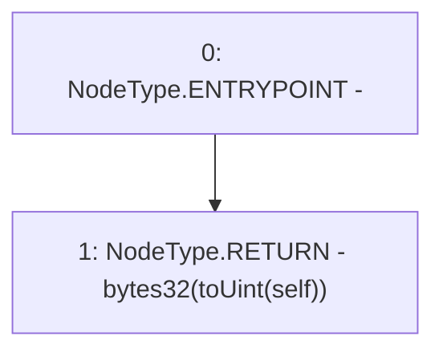

# Context: Rlp.toBytes32

**Contract:** `Rlp` (Inherits: None)
**Signature:** `toBytes32(Rlp.Item) returns (bytes32)`
**Method Selector ID:** `Internal (No Method ID)`
**Visibility:** `internal`
**Environment-Free:** `Yes`
**Modifiers:** None

### State Variables Interaction
- **Reads:** None
- **Writes:** None

### Environment & Verification Flags
- **Uses Foundry Cheatcodes:** No
- **Has Echidna Properties:** No

### Internal Calls Tree
- None

### External Calls / Value Transfers
- None

### Control Flow Graph (CFG)


### Source Mapping
Declared in: `certora-ac-datasets/detasets/web3bugs/dataset/web3bugs/42/projects/mochi-library/contracts/Rlp.sol` on lines **274** to **276**

```solidity
    function toBytes32(Item memory self) internal pure returns (bytes32) {
        return bytes32(toUint(self));
    }

```
