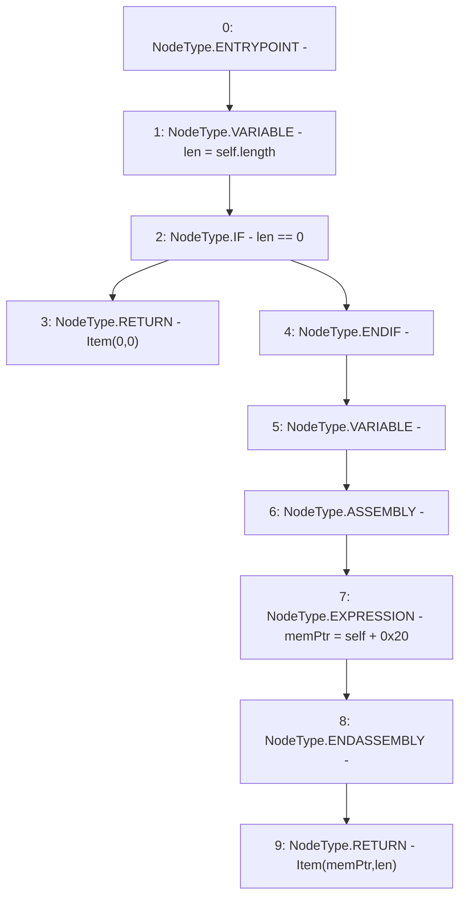

# Context: Rlp.toItem

**Contract:** `Rlp` (Inherits: None)
**Signature:** `toItem(bytes) returns (Rlp.Item)`
**Method Selector ID:** `Internal (No Method ID)`
**Visibility:** `internal`
**Environment-Free:** `Yes`
**Modifiers:** None

### State Variables Interaction
- **Reads:** None
- **Writes:** None

### Environment & Verification Flags
- **Uses Foundry Cheatcodes:** No
- **Has Echidna Properties:** No

### Internal Calls Tree
- None

### External Calls / Value Transfers
- None

### Control Flow Graph (CFG)


### Source Mapping
Declared in: `certora-ac-datasets/detasets/web3bugs/dataset/web3bugs/42/projects/mochi-library/contracts/Rlp.sol` on lines **51** to **61**

```solidity
    function toItem(bytes memory self) internal pure returns (Item memory) {
        uint len = self.length;
        if (len == 0) {
            return Item(0, 0);
        }
        uint memPtr;
        assembly {
            memPtr := add(self, 0x20)
        }
        return Item(memPtr, len);
    }

```
