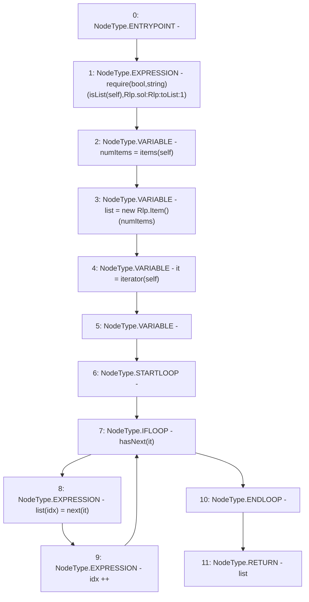

# Context: Rlp.toList

**Contract:** `Rlp` (Inherits: None)
**Signature:** `toList(Rlp.Item) returns (Rlp.Item[])`
**Method Selector ID:** `Internal (No Method ID)`
**Visibility:** `internal`
**Environment-Free:** `Yes`
**Modifiers:** None

### State Variables Interaction
- **Reads:** None
- **Writes:** None

### Assertion Checks & Business Requirements
- require/assert: `require(bool,string)(isList(self),Rlp.sol:Rlp:toList:1)`

### Environment & Verification Flags
- **Uses Foundry Cheatcodes:** No
- **Has Echidna Properties:** No

### Internal Calls Tree
- None

### External Calls / Value Transfers
- None

### Control Flow Graph (CFG)


### Source Mapping
Declared in: `certora-ac-datasets/detasets/web3bugs/dataset/web3bugs/42/projects/mochi-library/contracts/Rlp.sol` on lines **189** to **200**

```solidity
    function toList(Item memory self) internal pure returns (Item[] memory) {
        require(isList(self), "Rlp.sol:Rlp:toList:1");
        uint256 numItems = items(self);
        Item[] memory list = new Item[](numItems);
        Rlp.Iterator memory it = iterator(self);
        uint idx;
        while(hasNext(it)) {
            list[idx] = next(it);
            idx++;
        }
        return list;
    }

```
