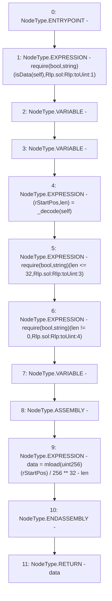

# Context: Rlp.toUint

**Contract:** `Rlp` (Inherits: None)
**Signature:** `toUint(Rlp.Item) returns (uint256)`
**Method Selector ID:** `Internal (No Method ID)`
**Visibility:** `internal`
**Environment-Free:** `Yes`
**Modifiers:** None

### State Variables Interaction
- **Reads:** None
- **Writes:** None

### Assertion Checks & Business Requirements
- require/assert: `require(bool,string)(isData(self),Rlp.sol:Rlp:toUint:1)`
- require/assert: `require(bool,string)(len <= 32,Rlp.sol:Rlp:toUint:3)`
- require/assert: `require(bool,string)(len != 0,Rlp.sol:Rlp:toUint:4)`

### Environment & Verification Flags
- **Uses Foundry Cheatcodes:** No
- **Has Echidna Properties:** No

### Internal Calls Tree
- None

### External Calls / Value Transfers
- None

### Control Flow Graph (CFG)


### Source Mapping
Declared in: `certora-ac-datasets/detasets/web3bugs/dataset/web3bugs/42/projects/mochi-library/contracts/Rlp.sol` on lines **219** to **229**

```solidity
    function toUint(Item memory self) internal pure returns (uint) {
        require(isData(self), "Rlp.sol:Rlp:toUint:1");
        (uint256 rStartPos, uint256 len) = _decode(self);
        require(len <= 32, "Rlp.sol:Rlp:toUint:3");
        require(len != 0, "Rlp.sol:Rlp:toUint:4");
        uint data;
        assembly {
            data := div(mload(rStartPos), exp(256, sub(32, len)))
        }
        return data;
    }

```
