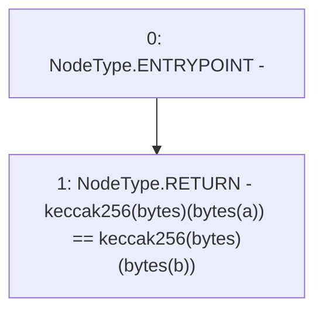

# Context: Strings.equal

**Contract:** `Strings` (Inherits: None)
**Signature:** `equal(string,string) returns (bool)`
**Method Selector ID:** `Internal (No Method ID)`
**Visibility:** `internal`
**Environment-Free:** `Yes`
**Modifiers:** None

### State Variables Interaction
- **Reads:** None
- **Writes:** None

### Environment & Verification Flags
- **Uses Foundry Cheatcodes:** No
- **Has Echidna Properties:** No

### Internal Calls Tree
- None

### External Calls / Value Transfers
- None

### Control Flow Graph (CFG)


### Source Mapping
Declared in: `certora-ac-datasets/detasets/web3bugs/dataset/web3bugs/42/projects/mochi-core/node_modules/@openzeppelin/contracts/utils/Strings.sol` on lines **82** to **84**

```solidity
    function equal(string memory a, string memory b) internal pure returns (bool) {
        return keccak256(bytes(a)) == keccak256(bytes(b));
    }

```
