# Context: SushiswapV2LPAdapter._getPrice

**Contract:** `SushiswapV2LPAdapter` (Inherits: ICSSRAdapter)
**Signature:** `_getPrice(IUniswapV2Pair,address) returns (float)`
**Method Selector ID:** `Internal (No Method ID)`
**Visibility:** `internal`
**Environment-Free:** `Yes`
**Modifiers:** None

### State Variables Interaction
- **Reads:** Q112, cssr, router, weth
- **Writes:** None

### Environment & Verification Flags
- **Uses Foundry Cheatcodes:** No
- **Has Echidna Properties:** No

### Internal Calls Tree
- None

### External Calls / Value Transfers
- `ICSSRRouter.TMP_65(float) = HIGH_LEVEL_CALL, dest:router(ICSSRRouter), function:getPrice, arguments:['weth']  `
- `IUniswapV2Pair.TMP_62(uint256) = HIGH_LEVEL_CALL, dest:_pair(IUniswapV2Pair), function:totalSupply, arguments:[]  `
- `IUniswapV2Pair.TUPLE_0(uint112,uint112,uint32) = HIGH_LEVEL_CALL, dest:_pair(IUniswapV2Pair), function:getReserves, arguments:[]  `
- `IUniswapV2Pair.TMP_58(uint256) = HIGH_LEVEL_CALL, dest:_pair(IUniswapV2Pair), function:totalSupply, arguments:[]  `
- `IUniswapV2Pair.TMP_22(address) = HIGH_LEVEL_CALL, dest:_pair(IUniswapV2Pair), function:token0, arguments:[]  `
- `IUniswapV2CSSR.TMP_21(uint256) = HIGH_LEVEL_CALL, dest:cssr(IUniswapV2CSSR), function:getExchangeRatio, arguments:['_underlying', 'weth']  `
- `Float.TMP_66(float) = LIBRARY_CALL, dest:Float, function:Float.mul(float,float), arguments:['TMP_64', 'TMP_65'] `

### Control Flow Graph (CFG)

```mermaid
flowchart TD
    Node_0["0: NodeType.ENTRYPOINT - "]
    Node_0 --> Node_1
    Node_1["1: NodeType.VARIABLE - eAvg = cssr.getExchangeRatio(_underlying,weth)"]
    Node_1 --> Node_2
    Node_2["2: NodeType.VARIABLE - "]
    Node_2 --> Node_3
    Node_3["3: NodeType.VARIABLE - "]
    Node_3 --> Node_4
    Node_4["4: NodeType.EXPRESSION - (_reserve0,_reserve1,None) = _pair.getReserves()"]
    Node_4 --> Node_5
    Node_5["5: NodeType.VARIABLE - "]
    Node_5 --> Node_6
    Node_6["6: NodeType.VARIABLE - "]
    Node_6 --> Node_7
    Node_7["7: NodeType.IF - _pair.token0() == _underlying"]
    Node_7 --> Node_8
    Node_7 --> Node_10
    Node_8["8: NodeType.EXPRESSION - aPool = uint256(_reserve0)"]
    Node_8 --> Node_9
    Node_9["9: NodeType.EXPRESSION - ePool = uint256(_reserve1)"]
    Node_9 --> Node_12
    Node_10["10: NodeType.EXPRESSION - aPool = uint256(_reserve1)"]
    Node_10 --> Node_11
    Node_11["11: NodeType.EXPRESSION - ePool = uint256(_reserve0)"]
    Node_11 --> Node_12
    Node_12["12: NodeType.ENDIF - "]
    Node_12 --> Node_13
    Node_13["13: NodeType.VARIABLE - eCurr = ePool * Q112 / aPool"]
    Node_13 --> Node_14
    Node_14["14: NodeType.VARIABLE - "]
    Node_14 --> Node_15
    Node_15["15: NodeType.IF - eCurr < eAvg"]
    Node_15 --> Node_16
    Node_15 --> Node_19
    Node_16["16: NodeType.VARIABLE - sqrtd = ePool * ((ePool * 9) + (aPool * 3988000 * eAvg / Q112))"]
    Node_16 --> Node_17
    Node_17["17: NodeType.VARIABLE - eChange = (sqrt(sqrtd) - (ePool * 1997)) / 2000"]
    Node_17 --> Node_18
    Node_18["18: NodeType.EXPRESSION - ePoolCalc = ePool + eChange"]
    Node_18 --> Node_26
    Node_19["19: NodeType.VARIABLE - a = aPool * eAvg"]
    Node_19 --> Node_20
    Node_20["20: NodeType.VARIABLE - b = a * 9 / Q112"]
    Node_20 --> Node_21
    Node_21["21: NodeType.VARIABLE - c = ePool * 3988000"]
    Node_21 --> Node_22
    Node_22["22: NodeType.VARIABLE - sqRoot = sqrt((a / Q112) * (b + c))"]
    Node_22 --> Node_23
    Node_23["23: NodeType.VARIABLE - d = a * 3 / Q112"]
    Node_23 --> Node_24
    Node_24["24: NodeType.VARIABLE - eChange_scope_0 = ePool - ((d + sqRoot) / 2000)"]
    Node_24 --> Node_25
    Node_25["25: NodeType.EXPRESSION - ePoolCalc = ePool - eChange_scope_0"]
    Node_25 --> Node_26
    Node_26["26: NodeType.ENDIF - "]
    Node_26 --> Node_27
    Node_27["27: NodeType.VARIABLE - num = ePoolCalc * 2"]
    Node_27 --> Node_28
    Node_28["28: NodeType.VARIABLE - "]
    Node_28 --> Node_29
    Node_29["29: NodeType.IF - num > Q112"]
    Node_29 --> Node_30
    Node_29 --> Node_31
    Node_30["30: NodeType.EXPRESSION - priceInEth = (num / _pair.totalSupply()) * Q112"]
    Node_30 --> Node_32
    Node_31["31: NodeType.EXPRESSION - priceInEth = num * Q112 / _pair.totalSupply()"]
    Node_31 --> Node_32
    Node_32["32: NodeType.ENDIF - "]
    Node_32 --> Node_33
    Node_33["33: NodeType.RETURN - float((numerator:priceInEth,denominator:Q112)).mul(router.getPrice(weth))"]
    Node_34["34: NodeType.RETURN - price"]
```


### Source Mapping
Declared in: `certora-ac-datasets/detasets/web3bugs/dataset/web3bugs/42/projects/mochi-cssr/contracts/adapter/SushiswapV2LPAdapter.sol` on lines **55** to **99**

```solidity
    function _getPrice(IUniswapV2Pair _pair, address _underlying) internal view returns(float memory price) {
        uint256 eAvg = cssr.getExchangeRatio(_underlying, weth);
        (uint112 _reserve0, uint112 _reserve1,) = _pair.getReserves();
        uint256 aPool; // current asset pool
        uint256 ePool; // current weth pool
        if (_pair.token0() == _underlying) {
            aPool = uint(_reserve0);
            ePool = uint(_reserve1);
        } else {
            aPool = uint(_reserve1);
            ePool = uint(_reserve0);
        }

        uint256 eCurr = ePool * Q112 / aPool; // current price of 1 token in weth
        uint256 ePoolCalc; // calculated weth pool

        if (eCurr < eAvg) {
            // flashloan buying weth
            uint256 sqrtd = ePool * (
                (ePool * 9)
                +(aPool * 3988000 * eAvg / Q112)
            );
            uint256 eChange = (sqrt(sqrtd) - (ePool * 1997)) / 2000;
            ePoolCalc = ePool + eChange;
        } else {
            // flashloan selling weth
            uint256 a = aPool * eAvg;
            uint256 b = a * 9 / Q112;
            uint256 c = ePool * 3988000;
            uint256 sqRoot = sqrt( (a / Q112) * (b + c));
            uint256 d = a * 3 / Q112;
            uint256 eChange = ePool - ((d + sqRoot) / 2000);
            ePoolCalc = ePool - eChange;
        }

        uint256 num = ePoolCalc * 2;
        uint256 priceInEth;
        if (num > Q112) {
            priceInEth = (num / _pair.totalSupply()) * Q112;
        } else {
            priceInEth = num * Q112 / _pair.totalSupply();
        }

        return float({numerator:priceInEth, denominator: Q112}).mul(router.getPrice(weth));
    }

```
