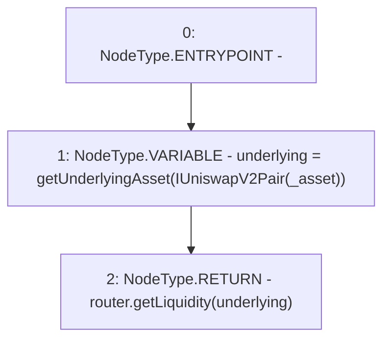

# Context: SushiswapV2LPAdapter.getLiquidity

**Contract:** `SushiswapV2LPAdapter` (Inherits: ICSSRAdapter)
**Signature:** `getLiquidity(address) returns (uint256)`
**Method Selector ID:** `0xa747b93b`
**Visibility:** `external`
**Environment-Free:** `Yes`
**Modifiers:** None

### State Variables Interaction
- **Reads:** router
- **Writes:** None

### Environment & Verification Flags
- **Uses Foundry Cheatcodes:** No
- **Has Echidna Properties:** No

### Internal Calls Tree
- None

### External Calls / Value Transfers
- `ICSSRRouter.TMP_69(uint256) = HIGH_LEVEL_CALL, dest:router(ICSSRRouter), function:getLiquidity, arguments:['underlying']  `

### Control Flow Graph (CFG)


### Source Mapping
Declared in: `certora-ac-datasets/detasets/web3bugs/dataset/web3bugs/42/projects/mochi-cssr/contracts/adapter/SushiswapV2LPAdapter.sol` on lines **101** to **104**

```solidity
    function getLiquidity(address _asset) external view override returns(uint256) {
        address underlying = getUnderlyingAsset(IUniswapV2Pair(_asset));
        return router.getLiquidity(underlying);
    }

```
