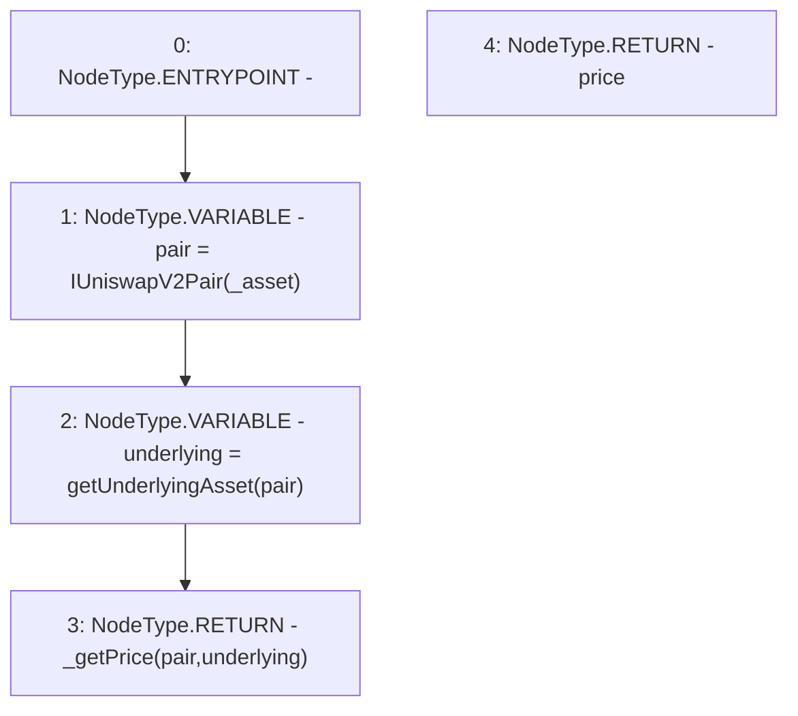

# Context: SushiswapV2LPAdapter.getPrice

**Contract:** `SushiswapV2LPAdapter` (Inherits: ICSSRAdapter)
**Signature:** `getPrice(address) returns (float)`
**Method Selector ID:** `0x41976e09`
**Visibility:** `external`
**Environment-Free:** `Yes`
**Modifiers:** None

### State Variables Interaction
- **Reads:** None
- **Writes:** None

### Environment & Verification Flags
- **Uses Foundry Cheatcodes:** No
- **Has Echidna Properties:** No

### Internal Calls Tree
- None

### External Calls / Value Transfers
- None

### Control Flow Graph (CFG)


### Source Mapping
Declared in: `certora-ac-datasets/detasets/web3bugs/dataset/web3bugs/42/projects/mochi-cssr/contracts/adapter/SushiswapV2LPAdapter.sol` on lines **49** to **53**

```solidity
    function getPrice(address _asset) external view override returns(float memory price){
        IUniswapV2Pair pair = IUniswapV2Pair(_asset);
        address underlying = getUnderlyingAsset(pair);
        return _getPrice(pair, underlying);
    }

```
