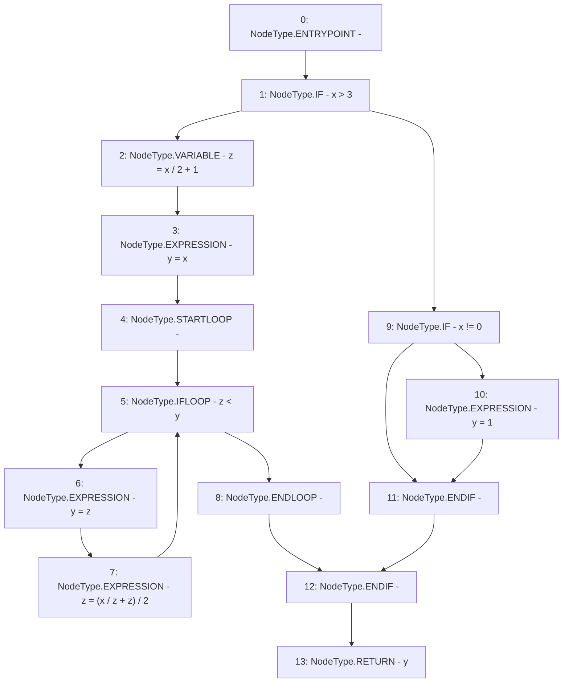

# Context: SushiswapV2LPAdapter.sqrt

**Contract:** `SushiswapV2LPAdapter` (Inherits: ICSSRAdapter)
**Signature:** `sqrt(uint256) returns (uint256)`
**Method Selector ID:** `Internal (No Method ID)`
**Visibility:** `internal`
**Environment-Free:** `Yes`
**Modifiers:** None

### State Variables Interaction
- **Reads:** None
- **Writes:** None

### Environment & Verification Flags
- **Uses Foundry Cheatcodes:** No
- **Has Echidna Properties:** No

### Internal Calls Tree
- None

### External Calls / Value Transfers
- None

### Control Flow Graph (CFG)


### Source Mapping
Declared in: `certora-ac-datasets/detasets/web3bugs/dataset/web3bugs/42/projects/mochi-cssr/contracts/adapter/SushiswapV2LPAdapter.sol` on lines **106** to **117**

```solidity
    function sqrt(uint x) internal pure returns (uint y) {
        if (x > 3) {
            uint z = x / 2 + 1;
            y = x;
            while (z < y) {
                y = z;
                z = (x / z + z) / 2;
            }
        } else if (x != 0) {
            y = 1;
        }
    }

```
