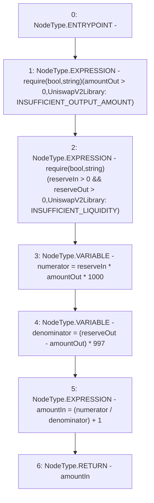

# Context: SushiswapV2Library.getAmountIn

**Contract:** `SushiswapV2Library` (Inherits: None)
**Signature:** `getAmountIn(uint256,uint256,uint256) returns (uint256)`
**Method Selector ID:** `Internal (No Method ID)`
**Visibility:** `internal`
**Environment-Free:** `Yes`
**Modifiers:** None

### State Variables Interaction
- **Reads:** None
- **Writes:** None

### Assertion Checks & Business Requirements
- require/assert: `require(bool,string)(amountOut > 0,UniswapV2Library: INSUFFICIENT_OUTPUT_AMOUNT)`
- require/assert: `require(bool,string)(reserveIn > 0 && reserveOut > 0,UniswapV2Library: INSUFFICIENT_LIQUIDITY)`

### Environment & Verification Flags
- **Uses Foundry Cheatcodes:** No
- **Has Echidna Properties:** No

### Internal Calls Tree
- None

### External Calls / Value Transfers
- None

### Control Flow Graph (CFG)


### Source Mapping
Declared in: `certora-ac-datasets/detasets/web3bugs/dataset/web3bugs/42/projects/mochi-library/contracts/SushiswapV2Library.sol` on lines **53** to **59**

```solidity
    function getAmountIn(uint amountOut, uint reserveIn, uint reserveOut) internal pure returns (uint amountIn) {
        require(amountOut > 0, 'UniswapV2Library: INSUFFICIENT_OUTPUT_AMOUNT');
        require(reserveIn > 0 && reserveOut > 0, 'UniswapV2Library: INSUFFICIENT_LIQUIDITY');
        uint numerator = reserveIn * amountOut * 1000;
        uint denominator = (reserveOut - amountOut) * 997;
        amountIn = (numerator / denominator) + 1;
    }

```
