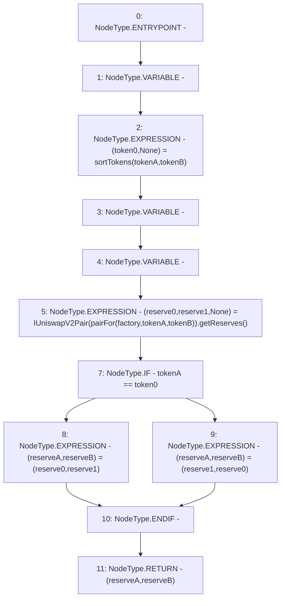

# Context: SushiswapV2Library.getReserves

**Contract:** `SushiswapV2Library` (Inherits: None)
**Signature:** `getReserves(address,address,address) returns (uint256, uint256)`
**Method Selector ID:** `Internal (No Method ID)`
**Visibility:** `internal`
**Environment-Free:** `Yes`
**Modifiers:** None

### State Variables Interaction
- **Reads:** None
- **Writes:** None

### Environment & Verification Flags
- **Uses Foundry Cheatcodes:** No
- **Has Echidna Properties:** No

### Internal Calls Tree
- None

### External Calls / Value Transfers
- `IUniswapV2Pair.TUPLE_2(uint112,uint112,uint32) = HIGH_LEVEL_CALL, dest:TMP_15(IUniswapV2Pair), function:getReserves, arguments:[]  `

### Control Flow Graph (CFG)


### Source Mapping
Declared in: `certora-ac-datasets/detasets/web3bugs/dataset/web3bugs/42/projects/mochi-library/contracts/SushiswapV2Library.sol` on lines **29** to **33**

```solidity
    function getReserves(address factory, address tokenA, address tokenB) internal view returns (uint reserveA, uint reserveB) {
        (address token0,) = sortTokens(tokenA, tokenB);
        (uint reserve0, uint reserve1,) = IUniswapV2Pair(pairFor(factory, tokenA, tokenB)).getReserves();
        (reserveA, reserveB) = tokenA == token0 ? (reserve0, reserve1) : (reserve1, reserve0);
    }

```
