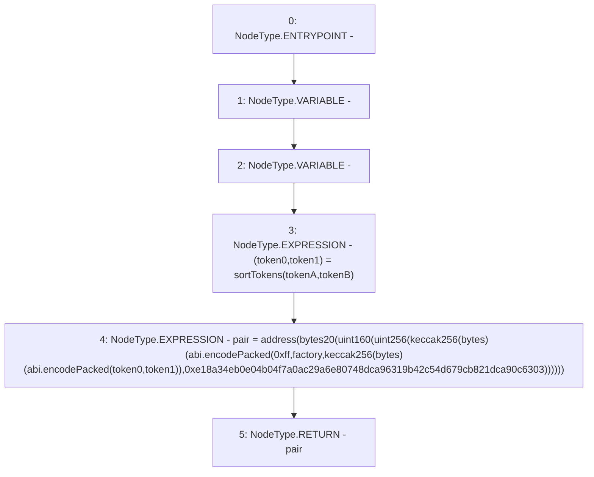

# Context: SushiswapV2Library.pairFor

**Contract:** `SushiswapV2Library` (Inherits: None)
**Signature:** `pairFor(address,address,address) returns (address)`
**Method Selector ID:** `Internal (No Method ID)`
**Visibility:** `internal`
**Environment-Free:** `Yes`
**Modifiers:** None

### State Variables Interaction
- **Reads:** None
- **Writes:** None

### Environment & Verification Flags
- **Uses Foundry Cheatcodes:** No
- **Has Echidna Properties:** No

### Internal Calls Tree
- None

### External Calls / Value Transfers
- None

### Control Flow Graph (CFG)


### Source Mapping
Declared in: `certora-ac-datasets/detasets/web3bugs/dataset/web3bugs/42/projects/mochi-library/contracts/SushiswapV2Library.sol` on lines **18** to **26**

```solidity
    function pairFor(address factory, address tokenA, address tokenB) internal pure returns (address pair) {
        (address token0, address token1) = sortTokens(tokenA, tokenB);
        pair = address(bytes20(uint160(uint256(keccak256(abi.encodePacked(
                hex'ff',
                factory,
                keccak256(abi.encodePacked(token0, token1)),
                hex'e18a34eb0e04b04f7a0ac29a6e80748dca96319b42c54d679cb821dca90c6303'
            ))))));
    }

```
