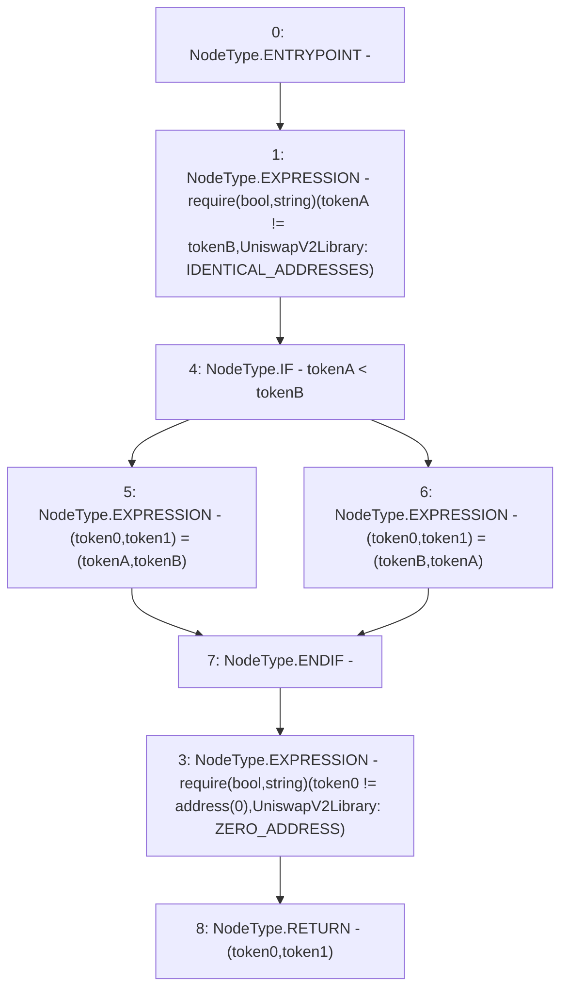

# Context: SushiswapV2Library.sortTokens

**Contract:** `SushiswapV2Library` (Inherits: None)
**Signature:** `sortTokens(address,address) returns (address, address)`
**Method Selector ID:** `Internal (No Method ID)`
**Visibility:** `internal`
**Environment-Free:** `Yes`
**Modifiers:** None

### State Variables Interaction
- **Reads:** None
- **Writes:** None

### Assertion Checks & Business Requirements
- require/assert: `require(bool,string)(tokenA != tokenB,UniswapV2Library: IDENTICAL_ADDRESSES)`
- require/assert: `require(bool,string)(token0 != address(0),UniswapV2Library: ZERO_ADDRESS)`

### Environment & Verification Flags
- **Uses Foundry Cheatcodes:** No
- **Has Echidna Properties:** No

### Internal Calls Tree
- None

### External Calls / Value Transfers
- None

### Control Flow Graph (CFG)


### Source Mapping
Declared in: `certora-ac-datasets/detasets/web3bugs/dataset/web3bugs/42/projects/mochi-library/contracts/SushiswapV2Library.sol` on lines **11** to **15**

```solidity
    function sortTokens(address tokenA, address tokenB) internal pure returns (address token0, address token1) {
        require(tokenA != tokenB, 'UniswapV2Library: IDENTICAL_ADDRESSES');
        (token0, token1) = tokenA < tokenB ? (tokenA, tokenB) : (tokenB, tokenA);
        require(token0 != address(0), 'UniswapV2Library: ZERO_ADDRESS');
    }

```
