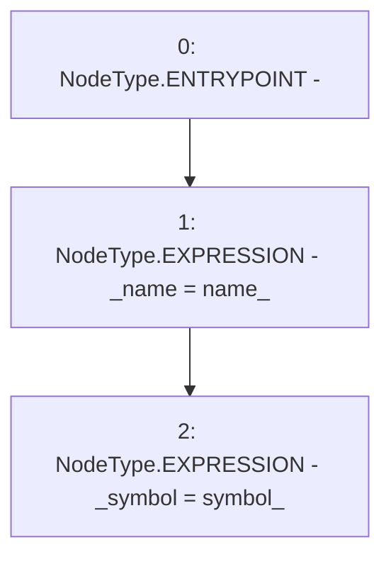

# Context: USDM.constructor

**Contract:** `USDM` (Inherits: IUSDM, IERC3156FlashLender, ERC20, IERC20Metadata, IERC20, Context)
**Signature:** `constructor(string,string)`
**Method Selector ID:** `0xd4d8c5c3`
**Visibility:** `public`
**Environment-Free:** `Yes`
**Modifiers:** None

### State Variables Interaction
- **Reads:** None
- **Writes:** _name, _symbol

### Environment & Verification Flags
- **Uses Foundry Cheatcodes:** No
- **Has Echidna Properties:** No

### Internal Calls Tree
- None

### External Calls / Value Transfers
- None

### Control Flow Graph (CFG)


### Source Mapping
Declared in: `certora-ac-datasets/detasets/web3bugs/dataset/web3bugs/42/projects/mochi-core/node_modules/@openzeppelin/contracts/token/ERC20/ERC20.sol` on lines **54** to **57**

```solidity
    constructor(string memory name_, string memory symbol_) {
        _name = name_;
        _symbol = symbol_;
    }

```
