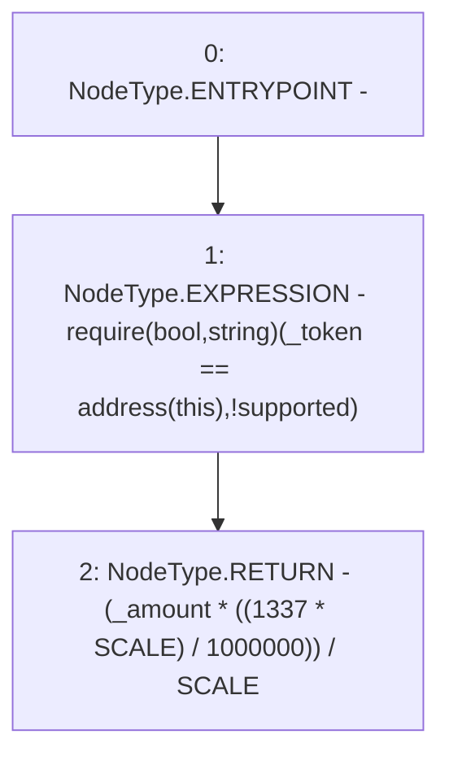

# Context: USDM.flashFee

**Contract:** `USDM` (Inherits: IUSDM, IERC3156FlashLender, ERC20, IERC20Metadata, IERC20, Context)
**Signature:** `flashFee(address,uint256) returns (uint256)`
**Method Selector ID:** `0xd9d98ce4`
**Visibility:** `public`
**Environment-Free:** `Yes`
**Modifiers:** None

### State Variables Interaction
- **Reads:** SCALE
- **Writes:** None

### Assertion Checks & Business Requirements
- require/assert: `require(bool,string)(_token == address(this),!supported)`

### Environment & Verification Flags
- **Uses Foundry Cheatcodes:** No
- **Has Echidna Properties:** No

### Internal Calls Tree
- None

### External Calls / Value Transfers
- None

### Control Flow Graph (CFG)


### Source Mapping
Declared in: `certora-ac-datasets/detasets/web3bugs/dataset/web3bugs/42/projects/mochi-core/contracts/assets/usdm.sol` on lines **48** to **57**

```solidity
    function flashFee(address _token, uint256 _amount)
        public
        view
        override
        returns (uint256)
    {
        //should return 0.1337% * _amount;
        require(_token == address(this), "!supported");
        return (_amount * ((1337 * SCALE) / 1000000)) / SCALE;
    }

```
