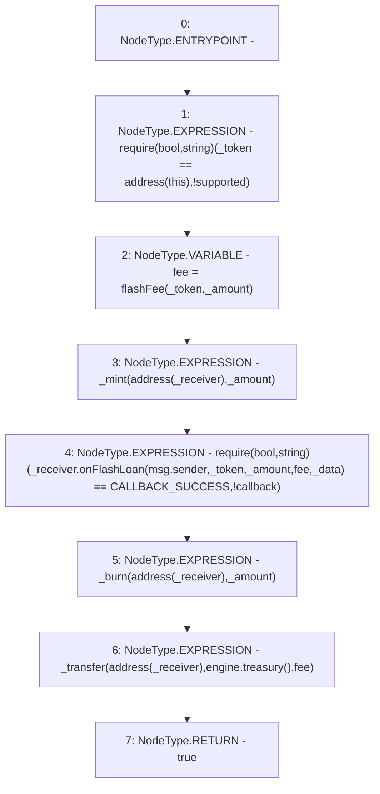

# Context: USDM.flashLoan

**Contract:** `USDM` (Inherits: IUSDM, IERC3156FlashLender, ERC20, IERC20Metadata, IERC20, Context)
**Signature:** `flashLoan(IERC3156FlashBorrower,address,uint256,bytes) returns (bool)`
**Method Selector ID:** `0x5cffe9de`
**Visibility:** `external`
**Environment-Free:** `No (reads EVM state context)`
**Modifiers:** None

### State Variables Interaction
- **Reads:** CALLBACK_SUCCESS, engine
- **Writes:** None

### Assertion Checks & Business Requirements
- require/assert: `require(bool,string)(_token == address(this),!supported)`
- require/assert: `require(bool,string)(_receiver.onFlashLoan(msg.sender,_token,_amount,fee,_data) == CALLBACK_SUCCESS,!callback)`

### Environment & Verification Flags
- **Uses Foundry Cheatcodes:** No
- **Has Echidna Properties:** No

### Internal Calls Tree
- None

### External Calls / Value Transfers
- `IERC3156FlashBorrower.TMP_121(bytes32) = HIGH_LEVEL_CALL, dest:_receiver(IERC3156FlashBorrower), function:onFlashLoan, arguments:['msg.sender', '_token', '_amount', 'fee', '_data']  `
- `IMochiEngine.TMP_127(address) = HIGH_LEVEL_CALL, dest:engine(IMochiEngine), function:treasury, arguments:[]  `

### Control Flow Graph (CFG)


### Source Mapping
Declared in: `certora-ac-datasets/detasets/web3bugs/dataset/web3bugs/42/projects/mochi-core/contracts/assets/usdm.sol` on lines **59** to **76**

```solidity
    function flashLoan(
        IERC3156FlashBorrower _receiver,
        address _token,
        uint256 _amount,
        bytes calldata _data
    ) external override returns (bool) {
        require(_token == address(this), "!supported");
        uint256 fee = flashFee(_token, _amount);
        _mint(address(_receiver), _amount);
        require(
            _receiver.onFlashLoan(msg.sender, _token, _amount, fee, _data) ==
                CALLBACK_SUCCESS,
            "!callback"
        );
        _burn(address(_receiver), _amount);
        _transfer(address(_receiver), engine.treasury(), fee);
        return true;
    }

```
