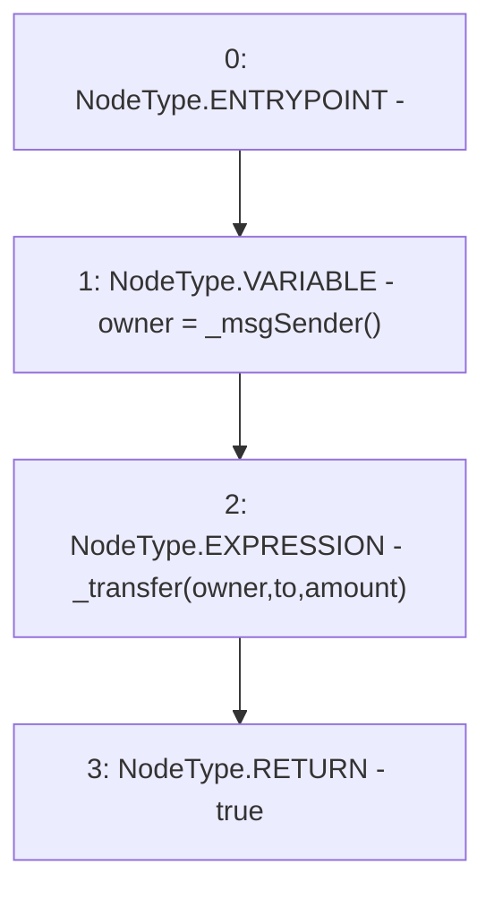

# Context: USDM.transfer

**Contract:** `USDM` (Inherits: IUSDM, IERC3156FlashLender, ERC20, IERC20Metadata, IERC20, Context)
**Signature:** `transfer(address,uint256) returns (bool)`
**Method Selector ID:** `0xa9059cbb`
**Visibility:** `public`
**Environment-Free:** `No (reads EVM state context)`
**Modifiers:** None

### State Variables Interaction
- **Reads:** None
- **Writes:** None

### Environment & Verification Flags
- **Uses Foundry Cheatcodes:** No
- **Has Echidna Properties:** No

### Internal Calls Tree
- None

### External Calls / Value Transfers
- None

### Control Flow Graph (CFG)


### Source Mapping
Declared in: `certora-ac-datasets/detasets/web3bugs/dataset/web3bugs/42/projects/mochi-core/node_modules/@openzeppelin/contracts/token/ERC20/ERC20.sol` on lines **113** to **117**

```solidity
    function transfer(address to, uint256 amount) public virtual override returns (bool) {
        address owner = _msgSender();
        _transfer(owner, to, amount);
        return true;
    }

```
