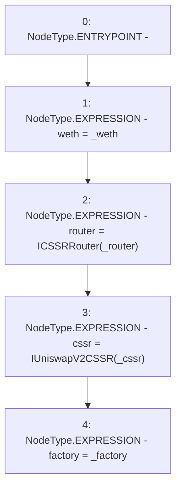

# Context: UniswapV2LPAdapter.constructor

**Contract:** `UniswapV2LPAdapter` (Inherits: ICSSRAdapter)
**Signature:** `constructor(address,address,address,address)`
**Method Selector ID:** `0xb0647061`
**Visibility:** `public`
**Environment-Free:** `Yes`
**Modifiers:** None

### State Variables Interaction
- **Reads:** None
- **Writes:** cssr, factory, router, weth

### Environment & Verification Flags
- **Uses Foundry Cheatcodes:** No
- **Has Echidna Properties:** No

### Internal Calls Tree
- None

### External Calls / Value Transfers
- None

### Control Flow Graph (CFG)


### Source Mapping
Declared in: `certora-ac-datasets/detasets/web3bugs/dataset/web3bugs/42/projects/mochi-cssr/contracts/adapter/UniswapV2LPAdapter.sol` on lines **20** to **25**

```solidity
    constructor(address _weth, address _factory, address _router, address _cssr) {
        weth = _weth;
        router = ICSSRRouter(_router);
        cssr = IUniswapV2CSSR(_cssr);
        factory = _factory;
    }

```
