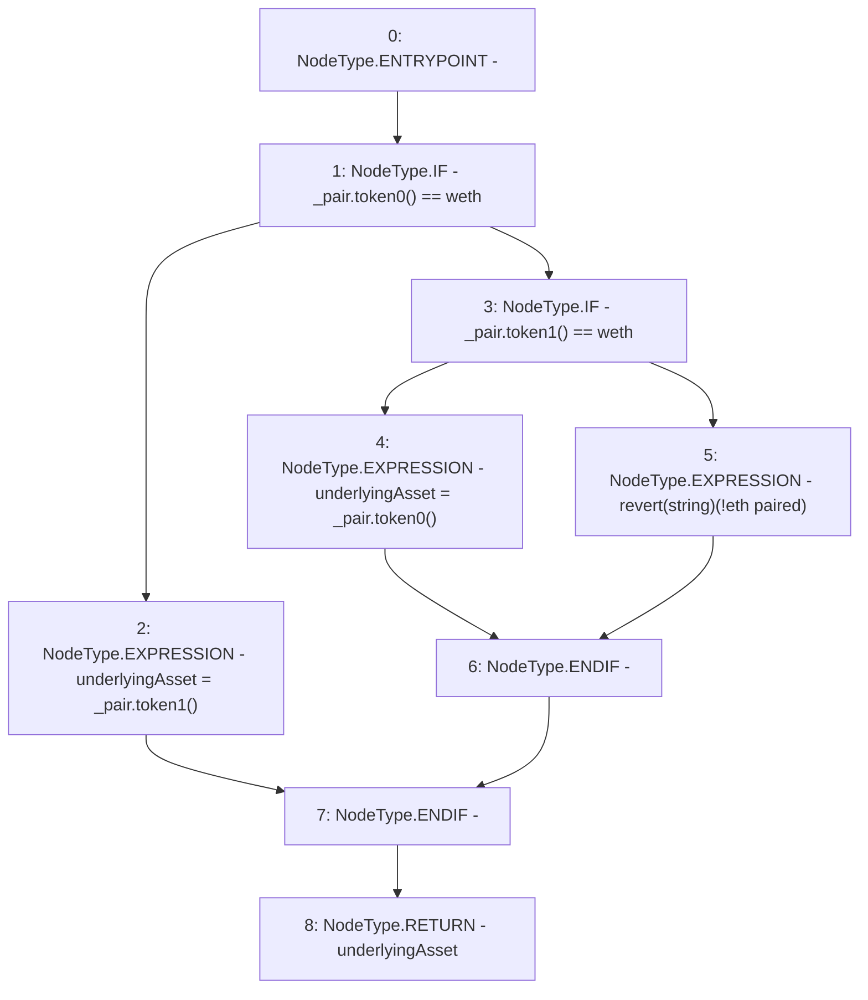

# Context: UniswapV2LPAdapter.getUnderlyingAsset

**Contract:** `UniswapV2LPAdapter` (Inherits: ICSSRAdapter)
**Signature:** `getUnderlyingAsset(IUniswapV2Pair) returns (address)`
**Method Selector ID:** `0xe8689daa`
**Visibility:** `public`
**Environment-Free:** `Yes`
**Modifiers:** None

### State Variables Interaction
- **Reads:** weth
- **Writes:** None

### Assertion Checks & Business Requirements
- revert: `revert(string)(!eth paired)`

### Environment & Verification Flags
- **Uses Foundry Cheatcodes:** No
- **Has Echidna Properties:** No

### Internal Calls Tree
- None

### External Calls / Value Transfers
- `IUniswapV2Pair.TMP_13(address) = HIGH_LEVEL_CALL, dest:_pair(IUniswapV2Pair), function:token1, arguments:[]  `
- `IUniswapV2Pair.TMP_16(address) = HIGH_LEVEL_CALL, dest:_pair(IUniswapV2Pair), function:token0, arguments:[]  `
- `IUniswapV2Pair.TMP_11(address) = HIGH_LEVEL_CALL, dest:_pair(IUniswapV2Pair), function:token0, arguments:[]  `
- `IUniswapV2Pair.TMP_14(address) = HIGH_LEVEL_CALL, dest:_pair(IUniswapV2Pair), function:token1, arguments:[]  `

### Control Flow Graph (CFG)


### Source Mapping
Declared in: `certora-ac-datasets/detasets/web3bugs/dataset/web3bugs/42/projects/mochi-cssr/contracts/adapter/UniswapV2LPAdapter.sol` on lines **39** to **47**

```solidity
    function getUnderlyingAsset(IUniswapV2Pair _pair) public view returns(address underlyingAsset) {
        if (_pair.token0() == weth) {
            underlyingAsset = _pair.token1();
        } else if (_pair.token1() == weth) {
            underlyingAsset = _pair.token0();
        } else {
            revert("!eth paired");
        }
    }

```
