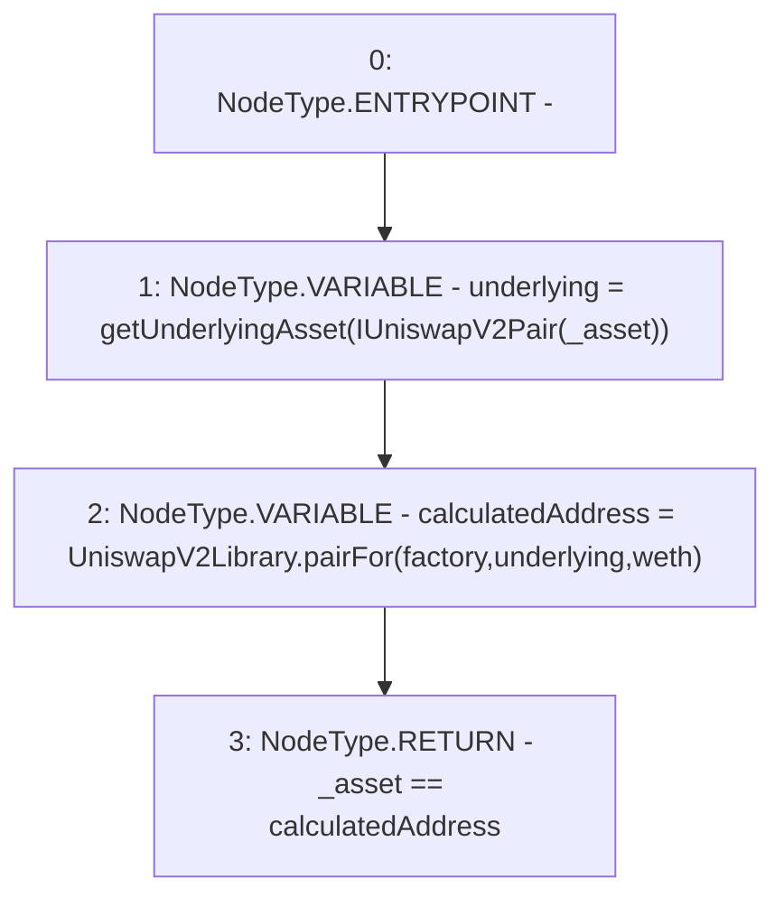

# Context: UniswapV2LPAdapter.support

**Contract:** `UniswapV2LPAdapter` (Inherits: ICSSRAdapter)
**Signature:** `support(address) returns (bool)`
**Method Selector ID:** `0xe660cc08`
**Visibility:** `external`
**Environment-Free:** `Yes`
**Modifiers:** None

### State Variables Interaction
- **Reads:** factory, weth
- **Writes:** None

### Environment & Verification Flags
- **Uses Foundry Cheatcodes:** No
- **Has Echidna Properties:** No

### Internal Calls Tree
- None

### External Calls / Value Transfers
- `UniswapV2Library.TMP_4(address) = LIBRARY_CALL, dest:UniswapV2Library, function:UniswapV2Library.pairFor(address,address,address), arguments:['factory', 'underlying', 'weth'] `

### Control Flow Graph (CFG)


### Source Mapping
Declared in: `certora-ac-datasets/detasets/web3bugs/dataset/web3bugs/42/projects/mochi-cssr/contracts/adapter/UniswapV2LPAdapter.sol` on lines **27** to **31**

```solidity
    function support(address _asset) external view override returns(bool) {
        address underlying = getUnderlyingAsset(IUniswapV2Pair(_asset));
        address calculatedAddress = UniswapV2Library.pairFor(factory, underlying, weth);
        return _asset == calculatedAddress;
    }

```
