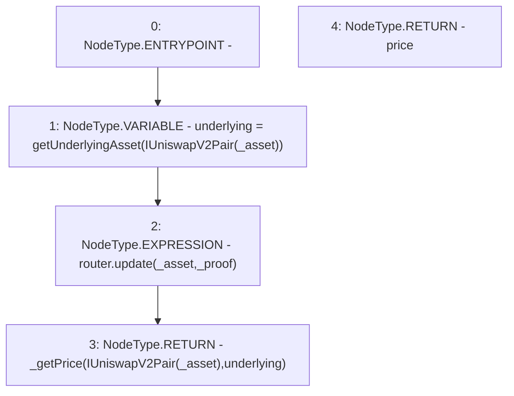

# Context: UniswapV2LPAdapter.update

**Contract:** `UniswapV2LPAdapter` (Inherits: ICSSRAdapter)
**Signature:** `update(address,bytes) returns (float)`
**Method Selector ID:** `0x02a688ed`
**Visibility:** `external`
**Environment-Free:** `Yes`
**Modifiers:** None

### State Variables Interaction
- **Reads:** router
- **Writes:** None

### Environment & Verification Flags
- **Uses Foundry Cheatcodes:** No
- **Has Echidna Properties:** No

### Internal Calls Tree
- None

### External Calls / Value Transfers
- `ICSSRRouter.TMP_8(float) = HIGH_LEVEL_CALL, dest:router(ICSSRRouter), function:update, arguments:['_asset', '_proof']  `

### Control Flow Graph (CFG)


### Source Mapping
Declared in: `certora-ac-datasets/detasets/web3bugs/dataset/web3bugs/42/projects/mochi-cssr/contracts/adapter/UniswapV2LPAdapter.sol` on lines **33** to **37**

```solidity
    function update(address _asset, bytes memory _proof) external override returns(float memory price) {
        address underlying = getUnderlyingAsset(IUniswapV2Pair(_asset));
        router.update(_asset, _proof);
        return _getPrice(IUniswapV2Pair(_asset), underlying);
    }

```
