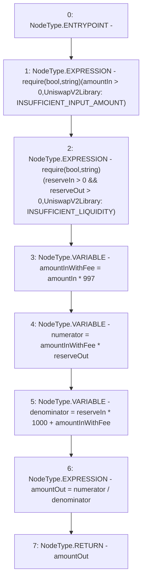

# Context: UniswapV2Library.getAmountOut

**Contract:** `UniswapV2Library` (Inherits: None)
**Signature:** `getAmountOut(uint256,uint256,uint256) returns (uint256)`
**Method Selector ID:** `Internal (No Method ID)`
**Visibility:** `internal`
**Environment-Free:** `Yes`
**Modifiers:** None

### State Variables Interaction
- **Reads:** None
- **Writes:** None

### Assertion Checks & Business Requirements
- require/assert: `require(bool,string)(amountIn > 0,UniswapV2Library: INSUFFICIENT_INPUT_AMOUNT)`
- require/assert: `require(bool,string)(reserveIn > 0 && reserveOut > 0,UniswapV2Library: INSUFFICIENT_LIQUIDITY)`

### Environment & Verification Flags
- **Uses Foundry Cheatcodes:** No
- **Has Echidna Properties:** No

### Internal Calls Tree
- None

### External Calls / Value Transfers
- None

### Control Flow Graph (CFG)


### Source Mapping
Declared in: `certora-ac-datasets/detasets/web3bugs/dataset/web3bugs/42/projects/mochi-library/contracts/UniswapV2Library.sol` on lines **43** to **50**

```solidity
    function getAmountOut(uint amountIn, uint reserveIn, uint reserveOut) internal pure returns (uint amountOut) {
        require(amountIn > 0, 'UniswapV2Library: INSUFFICIENT_INPUT_AMOUNT');
        require(reserveIn > 0 && reserveOut > 0, 'UniswapV2Library: INSUFFICIENT_LIQUIDITY');
        uint amountInWithFee = amountIn * 997;
        uint numerator = amountInWithFee * reserveOut;
        uint denominator = reserveIn * 1000 + amountInWithFee;
        amountOut = numerator / denominator;
    }

```
