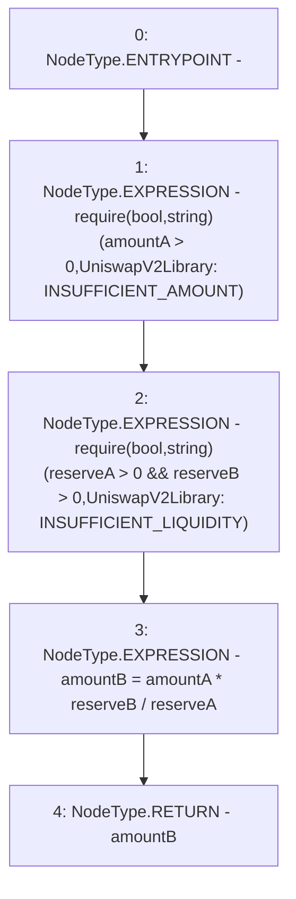

# Context: UniswapV2Library.quote

**Contract:** `UniswapV2Library` (Inherits: None)
**Signature:** `quote(uint256,uint256,uint256) returns (uint256)`
**Method Selector ID:** `Internal (No Method ID)`
**Visibility:** `internal`
**Environment-Free:** `Yes`
**Modifiers:** None

### State Variables Interaction
- **Reads:** None
- **Writes:** None

### Assertion Checks & Business Requirements
- require/assert: `require(bool,string)(amountA > 0,UniswapV2Library: INSUFFICIENT_AMOUNT)`
- require/assert: `require(bool,string)(reserveA > 0 && reserveB > 0,UniswapV2Library: INSUFFICIENT_LIQUIDITY)`

### Environment & Verification Flags
- **Uses Foundry Cheatcodes:** No
- **Has Echidna Properties:** No

### Internal Calls Tree
- None

### External Calls / Value Transfers
- None

### Control Flow Graph (CFG)


### Source Mapping
Declared in: `certora-ac-datasets/detasets/web3bugs/dataset/web3bugs/42/projects/mochi-library/contracts/UniswapV2Library.sol` on lines **36** to **40**

```solidity
    function quote(uint amountA, uint reserveA, uint reserveB) internal pure returns (uint amountB) {
        require(amountA > 0, 'UniswapV2Library: INSUFFICIENT_AMOUNT');
        require(reserveA > 0 && reserveB > 0, 'UniswapV2Library: INSUFFICIENT_LIQUIDITY');
        amountB = amountA * reserveB / reserveA;
    }

```
