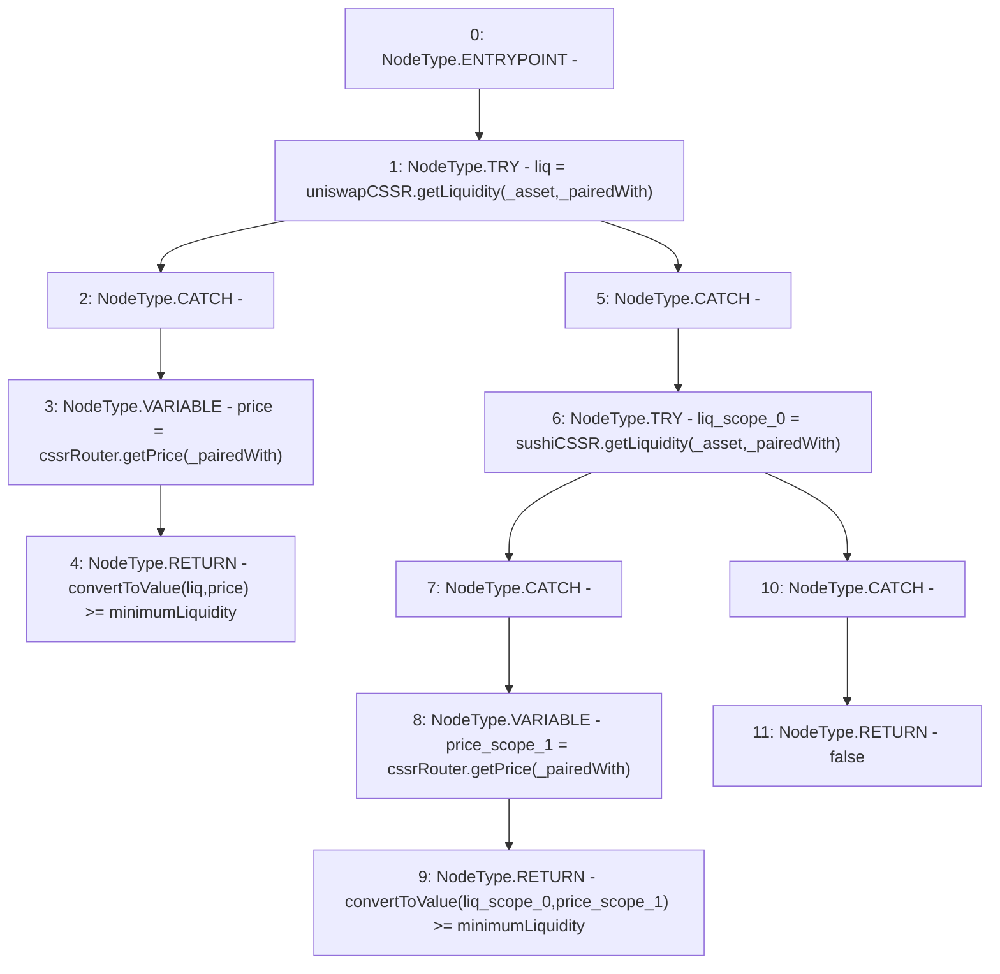

# Context: UniswapV2TokenAdapter.aboveLiquidity

**Contract:** `UniswapV2TokenAdapter` (Inherits: ICSSRAdapter)
**Signature:** `aboveLiquidity(address,address) returns (bool)`
**Method Selector ID:** `0xff9d4b83`
**Visibility:** `public`
**Environment-Free:** `Yes`
**Modifiers:** None

### State Variables Interaction
- **Reads:** cssrRouter, minimumLiquidity, sushiCSSR, uniswapCSSR
- **Writes:** None

### Environment & Verification Flags
- **Uses Foundry Cheatcodes:** No
- **Has Echidna Properties:** No

### Internal Calls Tree
- None

### External Calls / Value Transfers
- `ICSSRRouter.TMP_67(float) = HIGH_LEVEL_CALL, dest:cssrRouter(ICSSRRouter), function:getPrice, arguments:['_pairedWith']  `
- `ICSSRRouter.TMP_63(float) = HIGH_LEVEL_CALL, dest:cssrRouter(ICSSRRouter), function:getPrice, arguments:['_pairedWith']  `
- `IUniswapV2CSSR.TMP_62(uint256) = HIGH_LEVEL_CALL, dest:uniswapCSSR(IUniswapV2CSSR), function:getLiquidity, arguments:['_asset', '_pairedWith']  `
- `IUniswapV2CSSR.TMP_66(uint256) = HIGH_LEVEL_CALL, dest:sushiCSSR(IUniswapV2CSSR), function:getLiquidity, arguments:['_asset', '_pairedWith']  `

### Control Flow Graph (CFG)


### Source Mapping
Declared in: `certora-ac-datasets/detasets/web3bugs/dataset/web3bugs/42/projects/mochi-cssr/contracts/adapter/UniswapV2TokenAdapter.sol` on lines **198** to **218**

```solidity
    function aboveLiquidity(address _asset, address _pairedWith)
        public
        view
        returns (bool)
    {
        try uniswapCSSR.getLiquidity(_asset, _pairedWith) returns (
            uint256 liq
        ) {
            float memory price = cssrRouter.getPrice(_pairedWith);
            return convertToValue(liq, price) >= minimumLiquidity;
        } catch {
            try sushiCSSR.getLiquidity(_asset, _pairedWith) returns (
                uint256 liq
            ) {
                float memory price = cssrRouter.getPrice(_pairedWith);
                return convertToValue(liq, price) >= minimumLiquidity;
            } catch {
                return false;
            }
        }
    }

```
